# Geo localisation & Web Science

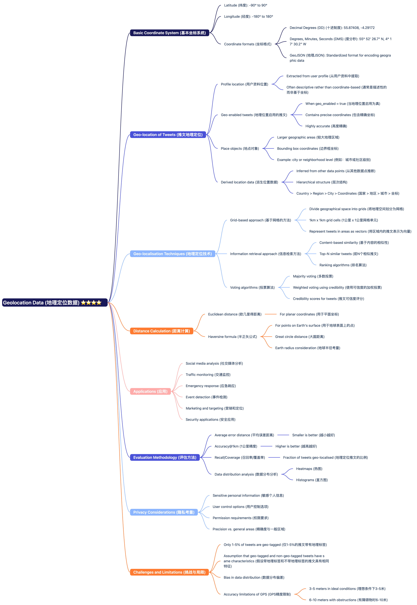

> **Geolocalisation** refers to the process of identifying or estimating the real-world geographic location of an object, such as a mobile device, internet-connected computer, or website visitor. 

> From a **geographical perspective**, geolocalisation involves determining physical coordinates (latitude and longitude) or place names (countries, cities, addresses) of entities in the real world. It relies on various technologies including GPS (Global Positioning System), cell tower triangulation, IP address mapping, and Wi-Fi positioning systems.

> From a **Web Science perspective**, geolocalisation is a fundamental component of location-based services, enabling personalized user experiences based on spatial context. It encompasses the collection, processing, and application of location data in web applications, social media platforms, and online services. This includes techniques for location-aware content delivery, spatial data visualization, privacy considerations around location tracking, and the analysis of geographic patterns in user behavior across the web.

## Table of Contents
- [Geo localisation \& Web Science](#geo-localisation--web-science)
  - [Table of Contents](#table-of-contents)
  - [Introduction to Geolocalisation](#introduction-to-geolocalisation)
    - [Definition and Importance](#definition-and-importance)
    - [Benefits of Geolocalisation](#benefits-of-geolocalisation)
    - [Geo-coordinate Definitions](#geo-coordinate-definitions)
  - [Types of Geolocalisation](#types-of-geolocalisation)
    - [Coarse-grained Geolocalisation](#coarse-grained-geolocalisation)
    - [Fine-grained Geolocalisation](#fine-grained-geolocalisation)
    - [Comparison of Approaches](#comparison-of-approaches)
  - [Geolocalisation in Social Media](#geolocalisation-in-social-media)
    - [Twitter Geolocation Data](#twitter-geolocation-data)
    - [Place Objects and Coordinates](#place-objects-and-coordinates)
    - [Privacy Considerations](#privacy-considerations)
  - [Geolocalisation Techniques](#geolocalisation-techniques)
    - [Information Retrieval Approach](#information-retrieval-approach)
    - [Grid-based Methods](#grid-based-methods)
    - [Majority Voting and Weighted Algorithms](#majority-voting-and-weighted-algorithms)
  - [Credibility in Geolocalisation](#credibility-in-geolocalisation)
    - [Defining Credibility](#defining-credibility)
    - [Computing Credibility Scores](#computing-credibility-scores)
    - [Weighted Approaches Using Credibility](#weighted-approaches-using-credibility)
  - [Evaluation Methodology](#evaluation-methodology)
    - [Ground Truth and Gold Standards](#ground-truth-and-gold-standards)
  - [Real-world Applications](#real-world-applications)
    - [Emergency Response](#emergency-response)
    - [Traffic Incident Detection](#traffic-incident-detection)
- [Social Media Data – Twitter/X](#social-media-data--twitterx)
  - [Importance of X platform](#importance-of-x-platform)
  - [Demographics](#demographics)
  - [Income distribution - above average?](#income-distribution---above-average)
  - [Political Beliefs](#political-beliefs)
  - [Bias in data](#bias-in-data)
  - [It's not about Twitter but about data](#its-not-about-twitter-but-about-data)
  - [Data Structure](#data-structure)
  - [Tweet Structure and Metadata](#tweet-structure-and-metadata)
    - [Basic Tweet Structure](#basic-tweet-structure)
      - [Example of Basic Tweet JSON Structure](#example-of-basic-tweet-json-structure)
    - [Communication Elements](#communication-elements)
    - [Metadata for Geolocation](#metadata-for-geolocation)
      - [Example: Tweet with Only Place Object (No Precise Coordinates)](#example-tweet-with-only-place-object-no-precise-coordinates)
      - [Example: Tweet with Location Mentioned in Text (No Explicit Geolocation)](#example-tweet-with-location-mentioned-in-text-no-explicit-geolocation)
    - [Data Structure for Analysis](#data-structure-for-analysis)
      - [Example: Structured Data for Geolocation Analysis](#example-structured-data-for-geolocation-analysis)
  - [Place Object](#place-object)
    - [Detailed Place Object Example](#detailed-place-object-example)
    - [Example: Tweet with Credibility Indicators for Geolocation](#example-tweet-with-credibility-indicators-for-geolocation)
  - [Tutorial Questions and Answers](#tutorial-questions-and-answers)
    - [Why do you think location information is important?](#why-do-you-think-location-information-is-important)
    - [What are the benefits of location information?](#what-are-the-benefits-of-location-information)
    - [How does Twitter encode location information \& their advantages and limitations?](#how-does-twitter-encode-location-information--their-advantages-and-limitations)
    - [Summary of Twitter Geolocation Data](#summary-of-twitter-geolocation-data)
- [Content Processing](#content-processing)
  - [Processing and Cleansing Social Media Data](#processing-and-cleansing-social-media-data)
    - [Text Preprocessing Pipeline](#text-preprocessing-pipeline)
  - [Text Vector Representation](#text-vector-representation)
    - [Vector Space Model for Documents and Queries](#vector-space-model-for-documents-and-queries)
    - [Binary Representation Approach](#binary-representation-approach)
  - [Similar Documents](#similar-documents)
  - [Cosine Similarity Measure](#cosine-similarity-measure)
  - [Length of a Vector](#length-of-a-vector)
  - [Unit Vector](#unit-vector)
  - [Similarity Computation](#similarity-computation)
    - [Cosine Similarity](#cosine-similarity)
    - [Similarity vs. Dissimilarity (Distance)](#similarity-vs-dissimilarity-distance)
    - [Working with Normalized Vectors:](#working-with-normalized-vectors)
  - [Text Processing Pipeline](#text-processing-pipeline)
  - [Term Weighting](#term-weighting)
    - [In documents, such as web pages:](#in-documents-such-as-web-pages)
    - [However, in tweets and short social media posts:](#however-in-tweets-and-short-social-media-posts)
  - [Finding similar tweets](#finding-similar-tweets)
    - [What is a cluster?](#what-is-a-cluster)
    - [Clustering in Text Analysis](#clustering-in-text-analysis)
    - [Applications of Tweet Clustering](#applications-of-tweet-clustering)
  - [Single-pass clustering](#single-pass-clustering)
  - [Cluster centroid](#cluster-centroid)
  - [Stream of tweets](#stream-of-tweets)
  - [Single Pass Clustering Steps](#single-pass-clustering-steps)
  - [How to group tweets](#how-to-group-tweets)
  - [Comments](#comments)
  - [Comments \& Observations](#comments--observations)
  - [Moving average](#moving-average)
  - [Credibility \& Newsworthiness Notes](#credibility--newsworthiness-notes)
    - [1. Defining Credibility in Social Media](#1-defining-credibility-in-social-media)
    - [2. Calculating Credibility Scores](#2-calculating-credibility-scores)
    - [3. Newsworthiness Factors](#3-newsworthiness-factors)
    - [4. Credibility-Weighted Geolocation](#4-credibility-weighted-geolocation)
    - [5. Credibility Indicators in Twitter Data](#5-credibility-indicators-in-twitter-data)
    - [6. Relationship Between Credibility and Accuracy](#6-relationship-between-credibility-and-accuracy)
    - [7. Key Takeaways](#7-key-takeaways)
  - [Online Brand Communities: Hate and Conflict Analysis Notes](#online-brand-communities-hate-and-conflict-analysis-notes)
    - [1. Foundational Definitions](#1-foundational-definitions)
    - [2. Typology of Online Brand Communities](#2-typology-of-online-brand-communities)
    - [3. Conflict Detection and Analysis Framework](#3-conflict-detection-and-analysis-framework)
    - [4. Hate Speech Detection Methodologies](#4-hate-speech-detection-methodologies)
    - [5. Brand Community Conflict Dynamics](#5-brand-community-conflict-dynamics)
    - [6. Methodological Approaches to Studying Brand Community Conflict](#6-methodological-approaches-to-studying-brand-community-conflict)
    - [7. Impact of Conflict on Brand Communities](#7-impact-of-conflict-on-brand-communities)
    - [8. Ethical Considerations and Governance](#8-ethical-considerations-and-governance)
  - [LLM Methods and Prompting Notes](#llm-methods-and-prompting-notes)
    - [1. Foundational Definitions and Models](#1-foundational-definitions-and-models)
    - [2. LLM Architectures and Taxonomy](#2-llm-architectures-and-taxonomy)
    - [3. Prompting Methodologies and Frameworks](#3-prompting-methodologies-and-frameworks)
    - [4. LLM Evaluation Methodologies](#4-llm-evaluation-methodologies)
    - [5. Applications in Web Science](#5-applications-in-web-science)
    - [6. Prompt Engineering for Social Media Research](#6-prompt-engineering-for-social-media-research)
    - [7. Ethical and Methodological Considerations](#7-ethical-and-methodological-considerations)
  - [Machine Learning and Deep Learning Applications Notes](#machine-learning-and-deep-learning-applications-notes)
    - [1. Foundational Definitions and Concepts](#1-foundational-definitions-and-concepts)
    - [2. Deep Learning Architectures for Social Media Analysis](#2-deep-learning-architectures-for-social-media-analysis)
    - [3. Machine Learning for Social Media Tasks](#3-machine-learning-for-social-media-tasks)
    - [4. Deep Learning for Event Detection and Monitoring](#4-deep-learning-for-event-detection-and-monitoring)
    - [5. Methodological Challenges and Solutions](#5-methodological-challenges-and-solutions)
    - [6. Applications in Social Media Research](#6-applications-in-social-media-research)
    - [7. Ethical and Responsible ML for Social Media](#7-ethical-and-responsible-ml-for-social-media)
  - [Emotion Analysis Notes](#emotion-analysis-notes)
    - [1. Foundational Definitions and Theoretical Frameworks](#1-foundational-definitions-and-theoretical-frameworks)
    - [2. Computational Approaches to Emotion Detection](#2-computational-approaches-to-emotion-detection)
    - [3. Emotion Analysis in Social Media](#3-emotion-analysis-in-social-media)
    - [4. Applications in Social Media Research](#4-applications-in-social-media-research)
    - [5. Methodological Challenges and Solutions](#5-methodological-challenges-and-solutions-1)
    - [6. Ethical Considerations in Emotion Analysis](#6-ethical-considerations-in-emotion-analysis)
    - [7. Future Directions in Social Media Emotion Analysis](#7-future-directions-in-social-media-emotion-analysis)
  - [Knowledge Graphs Notes](#knowledge-graphs-notes)
    - [1. Foundational Definitions and Concepts](#1-foundational-definitions-and-concepts-1)
    - [2. Knowledge Graph Construction and Population](#2-knowledge-graph-construction-and-population)
    - [3. Knowledge Graph Completion](#3-knowledge-graph-completion)
    - [4. Knowledge Graphs for Social Media Analysis](#4-knowledge-graphs-for-social-media-analysis)
    - [5. Reasoning and Inference with Knowledge Graphs](#5-reasoning-and-inference-with-knowledge-graphs)
    - [6. Applications of Knowledge Graphs in Web Science](#6-applications-of-knowledge-graphs-in-web-science)
    - [7. Challenges and Methodological Considerations](#7-challenges-and-methodological-considerations)
    - [8. Ethical and Social Implications](#8-ethical-and-social-implications)

## Introduction to Geolocalisation

### Definition and Importance

"Geo-localisation is the process of determining real-world geographic location of objects or people, important for personalized services and spatial analysis, implemented through various methods (GPS, IP, cell towers) with accuracy limitations, requiring careful evaluation methodology and awareness of potential biases."

### Benefits of Geolocalisation

Identifying the location of events, people, or incidents provides numerous critical benefits for society and services:

- **Quick responses from civil or security services**: Precise location information enables emergency services to respond rapidly to incidents. For example, when a fire is reported with accurate geolocation data, fire departments can dispatch the nearest units, potentially reducing response time by 3-5 minutes, which can be life-saving in critical situations.

- **Marking alerts to citizens**: Geolocation enables targeted emergency notifications to people in specific areas. During natural disasters like floods or wildfires, authorities can send evacuation orders or safety instructions only to those in affected zones, preventing unnecessary panic while ensuring those at risk receive timely information.

- **Enhanced service delivery**: Location data allows service providers to tailor their offerings based on geographical context. For instance, food delivery platforms can show only restaurants that deliver to a customer's specific location, improving user experience by filtering out irrelevant options.

- **Resource optimization**: Emergency management agencies can allocate resources more efficiently when they have precise location data. During large-scale incidents, they can visualize the geographic distribution of events and deploy personnel strategically.

The primary aim is to identify locations as precisely as possible:
- **Specific street vs. general area**: Identifying "Byres Road" provides much more actionable information than simply stating "west-end" of a city. This level of precision can be the difference between finding a victim quickly or conducting a prolonged search across a larger area.

- **Fine-grained nature**: The more precise the location information, the more effective the response can be. For example, knowing which floor and room number in a building can save precious minutes during medical emergencies.

Alternative approaches involve using fixed sensor networks:
- **Traffic cameras**: Strategically placed CCTV systems can monitor traffic conditions and detect incidents, but they are limited to their fixed viewpoints and cannot cover all areas.

- **Traffic flow measurements**: Sensors embedded in roadways can detect unusual patterns in vehicle movement that might indicate accidents, but they require extensive infrastructure investment and maintenance.

- **Environmental sensors**: These can detect conditions like flooding or air quality issues, providing location-specific data without relying on human reports.

While these sensor-based approaches provide reliable data, they lack the flexibility and coverage of crowdsourced geolocation information from mobile devices and social media, which can provide real-time updates from virtually anywhere people are present.

### Geo-coordinate Definitions

Geo-coordinates are numerical values that represent specific locations on the Earth's surface. They typically consist of:

- **Latitude**: A measure of the north-south position, expressed in degrees ranging from -90° (South Pole) to 90° (North Pole), with 0° representing the Equator.
- **Longitude**: A measure of the east-west position, expressed in degrees ranging from -180° to 180°, with 0° representing the Prime Meridian (passing through Greenwich, London).

These coordinates can be expressed in several formats:
- Decimal degrees (DD): e.g., 55.8724° N, 4.2900° W
- Degrees, minutes, seconds (DMS): e.g., 55° 52' 21" N, 4° 17' 24" W
- Degrees and decimal minutes (DMM): e.g., 55° 52.35' N, 4° 17.40' W

Additional parameters sometimes included with geo-coordinates:
- **Altitude**: Height above or below sea level
- **Accuracy**: Margin of error in the coordinate measurement
- **Timestamp**: When the coordinates were recorded

Geo-coordinates serve as the foundation for mapping, navigation systems, GIS (Geographic Information Systems), location-based services, and spatial analysis in various applications.

## Types of Geolocalisation

### Coarse-grained Geolocalisation

Coarse-grained geolocalisation refers to the process of determining location at a broader level, such as:
- Country level
- State/region level
- City level

This approach provides less precise location information but may be sufficient for many applications and has fewer privacy implications.

### Fine-grained Geolocalisation

Fine-grained geolocalisation aims to determine location at a much more detailed level:
- Neighborhood level
- Street level
- Specific coordinates (latitude/longitude)

This approach provides highly precise location information, enabling more targeted services but raising greater privacy concerns.

### Comparison of Approaches

| Aspect | Coarse-grained Geolocalisation | Fine-grained Geolocalisation |
|--------|--------------------------------|------------------------------|
| **Precision** | Lower precision (region/city level) | Higher precision (street/neighborhood level) |
| **Use Cases** | Regional trends, country-specific services | Emergency response, hyperlocal services |
| **Data Requirements** | Less data needed | More detailed data required |
| **Privacy Concerns** | Lower privacy impact | Higher privacy impact |
| **Implementation Complexity** | Simpler to implement | More complex algorithms needed |
| **Example** | "Northeast England", "Newcastle" | "Elephant & Castle station, London" |

The choice between coarse-grained and fine-grained approaches depends on:
- The specific application requirements
- Available data sources
- Privacy considerations
- Required accuracy level
- Computational resources

For applications like emergency response or traffic incident detection, fine-grained geolocalisation is essential to provide precise location information. For broader applications like regional trend analysis or country-specific content delivery, coarse-grained approaches may be sufficient.

## Geolocalisation in Social Media

### Twitter Geolocation Data

Twitter provides several types of location data in tweets:
- User profile location (self-reported)
- Geo-tagged coordinates (when geo_enabled=true)
- Place objects (broader location information)

### Place Objects and Coordinates

Twitter provides different types of location data in tweets:

1. **Coordinates**: When a user enables precise location sharing (geo_enabled=true), tweets can include exact latitude and longitude coordinates:
   ```json
   {
     "user": {
       "id": 12345678,
       "screen_name": "example_user",
       "geo_enabled": true
     },
     "coordinates": {
       "type": "Point",
       "coordinates": [-0.27955033, 51.55598294]
     },
     "text": "Just witnessed a traffic accident on the highway #traffic #accident"
   }
   ```
   These coordinates provide the most precise location information and are ideal for fine-grained geolocalisation. The coordinates array follows the GeoJSON format where the first element is longitude and the second is latitude. This level of precision allows for exact positioning on a map, which is crucial for emergency response applications.

2. **Place Objects**: Twitter also provides place objects, which represent a larger geographic area:
   ```json
   {
     "user": {
       "id": 87654321,
       "screen_name": "another_user"
     },
     "place": {
       "id": "e4a0dfa469c30504",
       "place_type": "city",
       "place_name": "Wexford",
       "full_name": "Wexford, Ireland",
       "country": "Ireland",
       "country_code": "IE",
       "bounding_box": {
         "type": "Polygon",
         "coordinates": [[
           [-7.017507, 52.122381],
           [-7.017507, 52.797086],
           [-6.141269, 52.797086],
           [-6.141269, 52.122381]
         ]]
       }
     },
     "text": "Beautiful day in Wexford today! #sunshine"
   }
   ```
   The place object contains a bounding_box field with coordinates that define the boundaries of the place as a polygon. This provides less precise location information than exact coordinates but still offers valuable geographic context. The bounding box coordinates represent the southwest, northwest, northeast, and southeast corners of the area, respectively.

3. **User Profile Location**: Users can also specify their location in their profile, but this is:
   - Self-reported and can be found in the user object:
   ```json
   {
     "user": {
       "id": 98765432,
       "screen_name": "profile_location_user",
       "location": "London, UK",
       "geo_enabled": false
     },
     "text": "Just my thoughts on the current situation #opinion"
   }
   ```
   This location field is:
   - Not verified by Twitter
   - Often imprecise (e.g., "London" could refer to London, UK or London, Ontario)
   - Sometimes fictional (e.g., "Hogwarts" or "Somewhere in cyberspace")
   - Not directly tied to individual tweets (represents the user's general location, not where they were when tweeting)

When working with Twitter data for geolocalisation, it's important to understand the differences between these location types and their implications for accuracy and reliability. Coordinates provide the highest precision but are the least common, while profile locations are the most common but least reliable. Place objects offer a middle ground, providing verified geographic information at a broader scale.

### Privacy Considerations

Geolocalisation raises significant privacy concerns, particularly in social media contexts:

1. **User Consent and Awareness**:
   - Many users may not fully understand the implications of sharing their location
   - The granularity of shared location data may not be clear to users
   - Users might inadvertently reveal sensitive locations (home, workplace)

2. **Personal Safety Risks**:
   - Precise location data can expose users to physical risks
   - Stalking and harassment concerns
   - Potential for burglary when users share that they're away from home

3. **Regulatory Considerations**:
   - GDPR and other privacy regulations place restrictions on location data collection
   - Requirements for explicit consent and data minimization
   - Right to be forgotten applies to historical location data

4. **Ethical Research Practices**:
   - Researchers must consider privacy implications when using geolocation data
   - Anonymization techniques should be applied
   - Aggregation of data to protect individual privacy

5. **Technical Safeguards**:
   - Geofencing to limit precision of shared location
   - Time-limited location sharing
   - User controls for location history

The tension between utility and privacy is particularly acute in geolocalisation. While precise location data enables valuable services and research, it also creates significant privacy risks that must be carefully managed through technical, legal, and ethical frameworks.

## Geolocalisation Techniques

### Information Retrieval Approach

The Information Retrieval (IR) approach to geolocalisation treats location prediction as a retrieval problem:

1. **Basic Concept**:
   - Treat each location as a "document"
   - Treat the content of a tweet (or other text) as a "query"
   - Rank locations based on their relevance to the query
   - Assign the highest-ranked location to the query

2. **Implementation Steps**:
   - Collect geo-tagged tweets as training data
   - Create location "documents" by aggregating all tweets from each location
   - Build an inverted index mapping terms to locations
   - For a new tweet without location, query the index to find the most relevant location
   - Rank locations using standard IR ranking functions (e.g., TF-IDF, BM25)

3. **Example Process**:
   - For a tweet mentioning "Elephant & Castle station fire"
   - The IR system would match these terms against the location index
   - Locations where these terms frequently appear (e.g., London) would rank highly
   - The highest-ranked location would be assigned to the tweet

4. **Advantages**:
   - Leverages well-established IR techniques
   - Can handle textual content effectively
   - Scales well to large datasets
   - Can incorporate various ranking functions

5. **Limitations**:
   - Relies on the assumption that language is location-specific
   - May struggle with ambiguous location references
   - Performance depends on the quality and quantity of training data

The IR approach is particularly effective for fine-grained geolocalisation when there is sufficient training data with distinctive vocabulary for different locations.

### Grid-based Methods

Grid-based methods divide geographical space into discrete cells to simplify the geolocalisation process:

1. **Grid Creation**:
   - Divide the geographical area of interest into uniform grid cells
   - Common grid sizes include 1km × 1km for fine-grained analysis
   - Each grid cell is treated as a distinct location unit
   - Example: New York City might be divided into 48 rows × 47 columns = 2,256 grid cells

2. **Data Aggregation**:
   - Aggregate all tweets or text content within each grid cell
   - Create a language model or feature representation for each grid
   - This aggregation helps overcome data sparsity in individual locations

3. **Implementation Process**:
   - Assign each geo-tagged tweet to its corresponding grid cell based on coordinates
   - Combine all text from tweets in the same grid to create a "document" per grid
   - For non-geotagged tweets, predict the most likely grid cell using text analysis

4. **Advantages**:
   - Provides a standardized spatial framework for analysis
   - Simplifies the continuous geographical space into discrete units
   - Enables more efficient computational processing
   - Facilitates visualization and mapping of results

5. **Challenges**:
   - Grid size selection affects precision (smaller grids = higher precision but sparser data)
   - Boundary effects where relevant information crosses grid lines
   - Uneven distribution of data across grid cells
   - Urban areas typically have more data than rural areas

Grid-based methods are particularly useful for fine-grained geolocalisation in urban environments where sufficient data exists across the grid cells. The approach provides a balance between precision and computational efficiency.

### Majority Voting and Weighted Algorithms

Majority voting and weighted algorithms are ensemble approaches used to improve geolocalisation accuracy:

1. **Basic Majority Voting**:
   - Retrieve the top-N most similar geo-tagged tweets to a query tweet
   - Each similar tweet "votes" for its location
   - The location with the most votes is assigned to the query tweet
   - Simple implementation: count the number of votes for each location
   
   For example, if we have a query tweet Q and retrieve 10 similar tweets, where 6 are from London, 3 from Manchester, and 1 from Birmingham, the majority voting would assign London as the predicted location for Q.

2. **Weighted Majority Voting**:
   - Similar to basic majority voting, but each vote is weighted
   - Weights can be based on:
     - Similarity score between the query and retrieved tweet
     - Credibility of the tweet or user
     - Temporal relevance (more recent tweets may get higher weights)
   - The location with the highest weighted sum is assigned
   
   The weighted voting formula can be expressed as:
   ```
   Score(Location_i) = Σ(Similarity(Q, Tj) × I(Tj, Location_i))
   ```
   Where:
   - Q is the query tweet
   - Tj is the jth retrieved tweet
   - I(Tj, Location_i) is an indicator function that equals 1 if tweet Tj is from Location_i and 0 otherwise
   - Similarity(Q, Tj) is the similarity score between the query tweet and retrieved tweet

3. **Implementation Example**:
   ```python
   # Pseudocode for weighted majority voting
   def predict_location(query_tweet, reference_tweets):
       location_scores = {}
       for tweet in reference_tweets:
           similarity = calculate_similarity(query_tweet, tweet)
           location = tweet.location
           if location not in location_scores:
               location_scores[location] = 0
           location_scores[location] += similarity
       
       return max(location_scores, key=location_scores.get)
   ```
   
   This implementation calculates a weighted score for each location based on the similarity between the query tweet and reference tweets from that location. The location with the highest score is predicted.

4. **Advantages**:
   - Reduces the impact of outliers or irrelevant matches
   - Incorporates multiple signals for more robust prediction
   - Can be easily extended with different weighting schemes
   - Provides a confidence measure through vote distribution

5. **Research Reference**:
   - "On fine-grained geolocalisation of tweets and real-time traffic incident detection" by Jorge David Gonzalez Paule, Yeran Sun, Yashar Moshfeghi (https://doi.org/10.1016/j.ipm.2018.03.011)
   - This research demonstrates the effectiveness of weighted voting approaches for fine-grained geolocalisation

Weighted voting algorithms are particularly effective when combined with credibility measures, as they can prioritize more reliable information sources while still considering the diversity of evidence.

## Credibility in Geolocalisation

### Defining Credibility

The credibility of a user is a score that represents the user's posting activity and its relevance to the physical location they are posting from. In the context of geolocalisation, credibility measures how reliable a user's content is for determining geographic location. 

Credibility encompasses several dimensions:

1. **Spatial Credibility**: How consistently a user posts from or about specific locations. Users who regularly post from the same area are likely to have higher spatial credibility for that area.

2. **Content Credibility**: The accuracy and relevance of location-specific information in a user's posts. Users who provide detailed, verifiable information about locations tend to have higher content credibility.

3. **Temporal Credibility**: The recency and frequency of a user's location-related posts. More recent and frequent posts about a location may indicate higher credibility.

4. **Social Credibility**: The user's reputation and influence within the community. Verified accounts or accounts with large followings might be considered more credible sources of location information.

For example, a local news reporter who frequently posts about events in their city with accurate details would have high credibility for geolocalisation in that area. In contrast, a bot account posting generic content with randomly attached locations would have low credibility.

### Computing Credibility Scores

<!-- TODO: Updated based on the lecture slide -->

### Weighted Approaches Using Credibility

Incorporating credibility scores into geolocalisation algorithms can significantly improve accuracy:

1. **Credibility-Weighted Voting**:
   - In a voting-based geolocalisation system, each vote is weighted by the credibility score
   - Higher credibility tweets have more influence on the final location prediction
   - Formula: `Score(Location) = Sum(Credibility(Tweet_i) * Vote(Tweet_i, Location))`

   For example, if we have three tweets suggesting different locations:
   - Tweet 1: Location A, Credibility = 0.8
   - Tweet 2: Location A, Credibility = 0.3
   - Tweet 3: Location B, Credibility = 0.6

   The scores would be:
   - Location A: 0.8 + 0.3 = 1.1
   - Location B: 0.6

   Location A would be selected as it has the highest credibility-weighted score.

2. **Credibility Factors**:
   - User activity patterns (frequency and consistency of posting)
   - Relevance of content to the location
   - User verification status
   - Historical accuracy of location information
   - Account age and reputation

   Each of these factors can be quantified and combined into a comprehensive credibility score. For example:

   $$
   \text{Credibility}(\text{User}) = w_1 \times \text{ActivityScore} + w_2 \times \text{RelevanceScore} + w_3 \times \text{VerificationScore} + w_4 \times \text{HistoricalAccuracyScore} + w_5 \times \text{AccountAgeScore}
   $$

   Where w₁, w₂, w₃, w₄, and w₅ are weights that determine the relative importance of each factor.

3. **Implementation Considerations**:
   - Credibility scores may be normalized to ensure fair weighting:
     ```
     NormalizedCredibility(User) = (Credibility(User) - MinCredibility) / (MaxCredibility - MinCredibility)
     ```
   - Different aspects of credibility may be weighted differently based on their importance
   - Credibility can be computed dynamically or pre-computed for efficiency

   A practical implementation might look like:
   ```python
   def predict_location_with_credibility(query_tweet, reference_tweets, user_credibility):
       location_scores = {}
       for tweet in reference_tweets:
           similarity = calculate_similarity(query_tweet, tweet)
           credibility = user_credibility.get(tweet.user_id, 0.5)  # Default to 0.5 if unknown
           location = tweet.location
           
           if location not in location_scores:
               location_scores[location] = 0
           
           # Weight the vote by both similarity and credibility
           location_scores[location] += similarity * credibility
       
       return max(location_scores, key=location_scores.get)
   ```

4. **Advantages**:
   - Reduces the impact of spam or unreliable sources
   - Improves precision in fine-grained geolocalisation
   - Provides a mechanism to handle conflicting location evidence
   - Can adapt to different contexts and requirements

5. **Challenges**:
   - Defining appropriate credibility metrics
   - Balancing different credibility factors
   - Avoiding bias in credibility assessment
   - Computational overhead of calculating credibility scores

Credibility-weighted approaches represent an advanced technique in geolocalisation that goes beyond simple text matching or majority voting. By incorporating the reliability of information sources, these methods can achieve higher accuracy, especially in noisy or ambiguous scenarios.

## Evaluation Methodology

### Ground Truth and Gold Standards

For evaluating geolocalisation techniques, establishing reliable ground truth data is essential. This process involves:

1. **Using Geo-enabled Tweets as Ground Truth**:
   - Tweets with explicit geo-coordinates provide the most reliable ground truth
   - These coordinates are typically obtained from GPS-enabled devices
   - Example of geo-enabled tweet data:
   ```json
   {
     "id": "1234567890",
     "text": "Enjoying the view from Glasgow University tower!",
     "coordinates": {
       "type": "Point",
       "coordinates": [-4.2885, 55.8724]
     },
     "created_at": "2023-04-15T14:32:18Z"
   }
   ```
   - The coordinates field contains the exact longitude and latitude, which serves as the ground truth location

2. **Training and Testing Methodology**:
   - Split geo-enabled tweets into training and testing sets (typically 80/20 or 70/30 split)
   - Use the training set to build geolocalisation models
   - For testing, remove the location information and attempt to predict it
   - Compare predicted locations with the actual coordinates to measure accuracy
   - Cross-validation techniques (e.g., k-fold) can be used to ensure robust evaluation

3. **Creating Gold Standard Datasets**:
   - Manually verify a subset of geo-tagged tweets for higher confidence
   - Ensure diverse geographic coverage to avoid regional biases
   - Include tweets from different time periods to account for temporal variations
   - Balance urban and rural locations to test performance across population densities
   - Document the creation process and potential limitations for transparency

4. **Real-life Application Testing**:
   - After initial evaluation with ground truth data, apply techniques to real-world scenarios
   - Collect feedback from end-users or domain experts
   - Conduct case studies for specific applications (e.g., emergency response)
   - Measure performance metrics in production environments
   - Continuously update models based on new data and feedback

5. **Handling Ambiguous Cases**:
   - Some locations may have multiple valid interpretations
   - Create guidelines for resolving ambiguities consistently
   - Consider using multiple annotators and measuring inter-annotator agreement
   - Document cases where ground truth itself may be uncertain

By establishing reliable ground truth data and following rigorous evaluation methodologies, researchers can accurately assess the performance of different geolocalisation techniques and make meaningful comparisons between approaches.

## Real-world Applications

### Emergency Response

Geolocalisation plays a critical role in emergency response scenarios:

1. **Disaster Management**:
   - Identifying affected areas through social media posts
   - Monitoring the spread of disasters (floods, fires, earthquakes) in real-time
   - Example: During hurricanes, geolocated tweets can help identify areas with flooding or damage

2. **Resource Allocation**:
   - Prioritizing areas with the most urgent needs
   - Directing emergency services to specific locations
   - Optimizing evacuation routes based on real-time information

3. **Public Safety Alerts**:
   - Sending targeted warnings to people in specific areas
   - Providing location-specific instructions during emergencies
   - Reaching people who might not have access to traditional media

4. **Implementation Challenges**:
   - Need for real-time processing with minimal latency
   - Handling misinformation during crisis situations
   - Ensuring system reliability when infrastructure may be compromised

5. **Case Study Example**:
   - During the London Elephant & Castle fire (mentioned in the lecture), fine-grained geolocalisation of tweets helped emergency services understand the situation and respond appropriately

Fine-grained geolocalisation is particularly valuable in emergency scenarios where precise location information can save lives and optimize resource allocation.

### Traffic Incident Detection

Geolocalisation enables advanced traffic monitoring and incident detection:

1. **Real-time Traffic Monitoring**:
   - Detecting traffic incidents through geolocated social media posts
   - Complementing traditional sensors with crowdsourced information
   - Providing earlier detection than official reporting systems

2. **Incident Verification**:
   - Cross-referencing multiple geolocated reports
   - Using credibility scores to filter reliable information
   - Combining social media data with official traffic data

3. **Traffic Management**:
   - Rerouting traffic based on incident locations
   - Estimating incident duration and impact
   - Providing location-specific alternative route suggestions

4. **Research Applications**:
   - The paper "On fine-grained geolocalisation of tweets and real-time traffic incident detection" demonstrates how tweet geolocalisation can be used for traffic incident detection
   - Such systems can detect incidents faster than traditional methods

5. **Implementation Example**:
   - Monitor tweets containing traffic-related terms
   - Apply fine-grained geolocalisation to determine precise incident location
   - Verify through multiple sources and credibility assessment
   - Integrate with traffic management systems

This application demonstrates how social media geolocalisation can complement traditional sensor networks to improve urban mobility and safety.


%20⭐⭐⭐.png)

# Social Media Data – Twitter/X

## Importance of X platform

- Vital communications platform in times of disasters
  - Hurricanes, earthquakes, political upheavals, travel disruptions
  - Enables real-time information sharing when traditional media may be unavailable
  - Facilitates coordination between affected individuals and emergency services
- Hence, scientists (social science), business leaders, security experts gather:
  - Twitter data to understand human behavior and dynamics
  - For example, role of micro-influencers: detection of informative tweets in crisis events
  - Analysis of information spread patterns during emergencies helps improve disaster response

## Demographics

- Men use X more than women, accounting for almost 68% of the platform's user base
  - This gender imbalance may affect the representativeness of data collected from the platform
- More than 80% of Twitter's global population is under 50 years old
  - Indicates a skew toward younger generations, potentially underrepresenting older perspectives
- More teenagers are on Twitter in the U.S. than on:
  - WhatsApp, Pinterest, LinkedIn, and Reddit
  - Shows Twitter's significant penetration among youth demographics
- Twitter ranks only slightly behind Instagram when it comes to 65+ users in the U.S. (7% vs. 8%)
  - Despite being youth-oriented, still maintains some presence among older populations

> Similarly ranked sites include Snapchat and TikTok for younger demographics, while Facebook has higher penetration among older users

## Income distribution - above average?

- 41% of Twitter users surveyed earn a household income about $75,000 (vs. 32% overall)
- Only 23% of people on Twitter earn less than $30,000 annually (vs. 30% overall)
- Education level of Twitter Users tends to be higher than average, with more college-educated users compared to the general population

> What does this mean?
> 
> This demographic profile indicates that Twitter users tend to be wealthier and more educated than the general population. This creates potential biases in geolocation data and analysis:
> 
> 1. Socioeconomic bias: Lower-income communities may be underrepresented in Twitter data, leading to "data deserts" in certain geographic areas
> 2. Educational bias: Higher education levels may influence how users describe locations and events
> 3. Geographic bias: Urban areas with better internet access may be overrepresented compared to rural regions
> 4. Age and gender biases: The perspectives of women, older adults, and certain minority groups may be underrepresented
> 
> These biases must be considered when using Twitter data for geolocation analysis, especially in emergency response scenarios where reaching all affected populations is critical.

## Political Beliefs

Twitter users in the United States tend to have a distinct political profile compared to the general population:

- 36% of Twitter users identify as Democrats, while only 21% identify as Republicans
- This 15-point gap is significantly larger than the 7-point difference in the general U.S. adult population
- Liberal and progressive viewpoints are more prevalent in Twitter discussions
- Users who post political content are more likely to be politically active offline as well
- Political polarization on Twitter often exceeds that observed in face-to-face interactions

> These political demographics have important implications for geolocation analysis:
> 
> 1. Political events may receive disproportionate attention based on alignment with the platform's dominant political leaning
> 2. Geographic areas with higher concentrations of conservative populations might be underrepresented in Twitter data
> 3. Interpretation of events may skew toward progressive perspectives
> 4. Researchers must account for this political bias when analyzing geolocation data related to politically sensitive topics or regions

## Bias in data

When analyzing social media data, particularly from Twitter/X, we must consider inherent biases:

- Social media usage varies significantly across different population segments
  - Twitter represents only a subset of the general population (as shown in demographics above)
  - Not everyone has equal access to or interest in social media platforms

- While Twitter has widespread adoption, it functions differently than traditional data sources:
  - A physical sensor (like a traffic camera or weather station) makes objective measurements
  - Twitter acts as a "social sensor" where humans generate the data points
    - For example, during the 2011 Japan earthquake, Twitter users reported the event 2-3 minutes before official seismic detection systems alerted authorities
    - During Hurricane Sandy (2012), geotagged tweets helped emergency services identify flooded areas faster than traditional reporting methods

- Twitter data often contains valuable information collected implicitly:
  - Users typically share information for personal reasons, not for data collection
  - This creates both an opportunity (authentic, real-time data) and challenge (noise and bias)
  - If we can effectively filter out irrelevant content and misinformation, tweets become valuable social sensors

- Demographics significantly impact data interpretation:
  - Why? Because the Twitter population doesn't mirror the general population
  - As shown above, Twitter users tend to be younger, more affluent, more educated, and more politically liberal
  - Geographic distribution is uneven, with urban areas overrepresented compared to rural regions
  
- When using Twitter for geolocation analysis, we must:
  - Acknowledge these biases in our methodology
  - Avoid making sweeping generalizations about entire populations
  - Supplement Twitter data with other sources when possible
  - Be especially cautious when analyzing underrepresented communities
  - Document limitations and potential biases in research findings

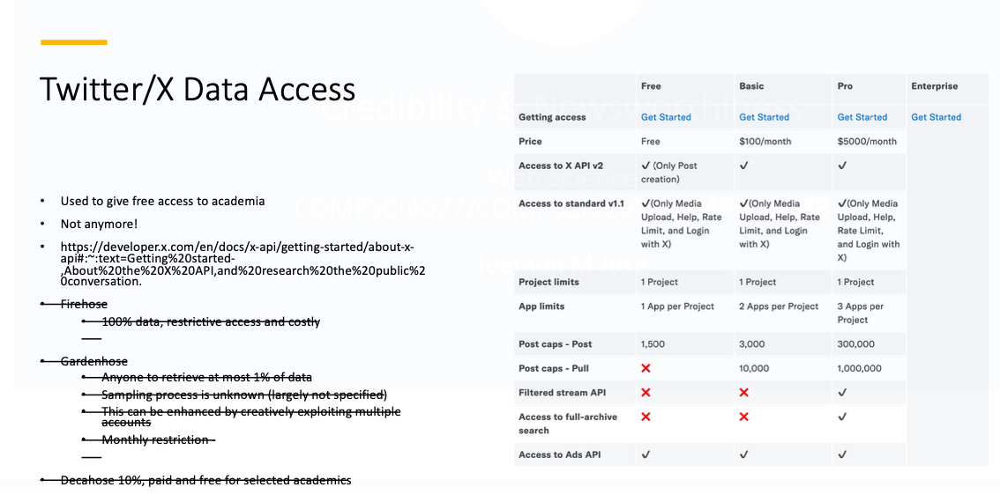

## It's not about Twitter but about data

This course extends beyond Twitter/X to focus on the broader challenge of extracting meaningful insights from large-scale unstructured data sources. Social media platforms provide excellent case studies for several reasons:

- **Unstructured and noisy data**: Social media content lacks formal organization and contains significant noise (irrelevant information, spam, etc.), presenting real-world data processing challenges.
- **Massive volume**: These platforms generate billions of interactions daily, requiring efficient processing techniques and methodologies.
- **Rich analytical potential**: Despite the challenges, these datasets contain valuable patterns about human behavior, events, trends, and geographic phenomena when properly analyzed.

We focus primarily on Twitter and Reddit data because:
- They offer diverse usage patterns (short-form vs. long-form content, different community structures)
- Extensive historical datasets are available for research purposes
- They provide accessible APIs for data collection and analysis
- They contain location-based information that enables geospatial analysis

## Data Structure

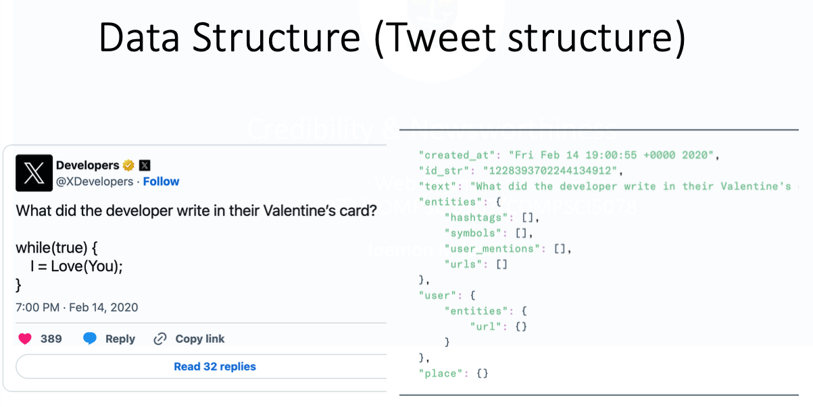

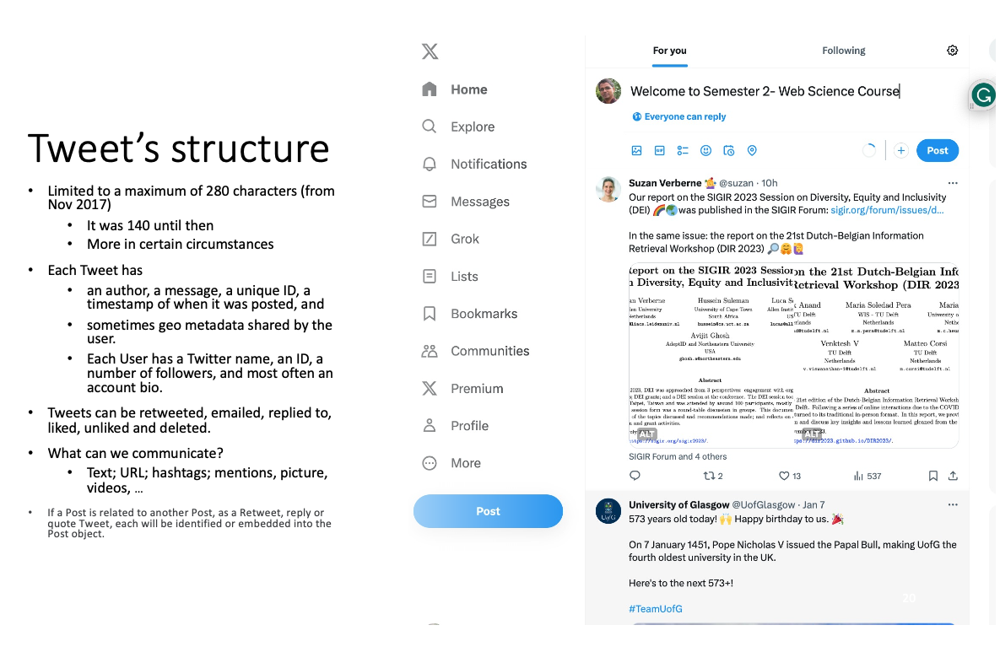

## Tweet Structure and Metadata

A tweet contains rich structured and unstructured data that can be leveraged for geolocation analysis:

### Basic Tweet Structure
- **Limited to 280 characters** (formerly 140 characters)
  - It was 140 until Twitter expanded the limit in 2017
  - Limits to certain circumstances still apply
- **Each tweet has a unique ID**
  - On Twitter, a message, a unique ID, a timestamp of when it was posted, and information about the user
  - This metadata is crucial for temporal analysis
- **Each user has a Twitter name, an ID, a profile description, and often a location field**
- **Tweets can be retweeted, replied to, liked, and bookmarked**

#### Example of Basic Tweet JSON Structure

```json
{
  "created_at": "Wed Oct 10 20:19:24 +0000 2023",
  "id": 1580623451872395264,
  "id_str": "1580623451872395264",
  "text": "Beautiful sunset over Glasgow Green today! #Glasgow #Sunset",
  "truncated": false,
  "source": "<a href=\"http://twitter.com/download/iphone\" rel=\"nofollow\">Twitter for iPhone</a>",
  "user": {
    "id": 87654321,
    "id_str": "87654321",
    "name": "Jane Smith",
    "screen_name": "janesmith",
    "location": "Glasgow, Scotland",
    "description": "Urban photographer and coffee enthusiast",
    "verified": false,
    "followers_count": 1243,
    "friends_count": 567,
    "time_zone": "London"
  },
  "coordinates": {
    "type": "Point",
    "coordinates": [-4.2333, 55.8500]
  },
  "place": {
    "id": "0e8b2a4c5f6d7e8f",
    "url": "https://api.twitter.com/1.1/geo/id/0e8b2a4c5f6d7e8f.json",
    "place_type": "city",
    "name": "Glasgow",
    "full_name": "Glasgow, Scotland",
    "country_code": "GB",
    "country": "United Kingdom",
    "bounding_box": {
      "type": "Polygon",
      "coordinates": [[
        [-4.3939, 55.7943],
        [-4.3939, 55.9072],
        [-4.0892, 55.9072],
        [-4.0892, 55.7943]
      ]]
    }
  },
  "entities": {
    "hashtags": [
      {"text": "Glasgow", "indices": [35, 43]},
      {"text": "Sunset", "indices": [44, 51]}
    ]
  },
  "geo_enabled": true
}
```

**Key Fields Explained:**
- `created_at`: Timestamp when the tweet was created, crucial for temporal analysis
- `text`: The actual content of the tweet, which may contain location references
- `user.location`: Self-reported location in the user's profile ("Glasgow, Scotland")
- `user.time_zone`: User's selected time zone, which can provide coarse location information
- `coordinates`: Precise geolocation data with longitude (-4.2333) and latitude 
- `place`: A structured object representing the location (Glasgow, Scotland)
- `entities.hashtags`: May contain location-relevant hashtags like "#Glasgow"

### Communication Elements
- What can we communicate?
  - Text, URLs, hashtags, mentions, pictures, videos, GIFs
  - If a tag is related to another tweet, it is, however, reply or retweet, and this information will be embedded into the tweet

### Metadata for Geolocation
- **Explicit location data**:
  - Precise coordinates (if location services enabled)
  - Place tags (city, neighborhood, venue)
  - User-defined location in profile (often unreliable)
- **Implicit location indicators**:
  - Time zones
  - Language settings
  - Local references in content
  - Mentioned locations in text

#### Example: Tweet with Only Place Object (No Precise Coordinates)

```json
{
  "created_at": "Thu Oct 12 13:45:10 +0000 2023",
  "id": 1581298765432198765,
  "id_str": "1581298765432198765",
  "text": "Traffic is terrible on the M8 this morning! #TrafficAlert #Glasgow",
  "user": {
    "id": 12345678,
    "id_str": "12345678",
    "name": "John Doe",
    "screen_name": "johndoe",
    "location": "Scotland, UK",
    "description": "Daily commuter, coffee lover",
    "verified": false
  },
  "coordinates": null,
  "place": {
    "id": "0e8b2a4c5f6d7e8f",
    "place_type": "city",
    "name": "Glasgow",
    "full_name": "Glasgow, Scotland",
    "country_code": "GB",
    "country": "United Kingdom",
    "bounding_box": {
      "type": "Polygon",
      "coordinates": [[
        [-4.3939, 55.7943],
        [-4.3939, 55.9072],
        [-4.0892, 55.9072],
        [-4.0892, 55.7943]
      ]]
    }
  },
  "geo_enabled": true
}
```

**Explanation:**
- This tweet has a `place` object but `coordinates` is null
- The user has enabled geolocation (`geo_enabled: true`) but chose to share only the general place (Glasgow) rather than precise coordinates
- For geolocation analysis, we can still determine that this tweet is about Glasgow, but we don't know the exact location within the city

#### Example: Tweet with Location Mentioned in Text (No Explicit Geolocation)

```json
{
  "created_at": "Fri Oct 13 09:23:45 +0000 2023",
  "id": 1582345678901234567,
  "id_str": "1582345678901234567",
  "text": "Hearing reports of a traffic accident near Buchanan Street station in Glasgow city center. Anyone know what's happening? #Glasgow",
  "user": {
    "id": 23456789,
    "id_str": "23456789",
    "name": "Local News Watcher",
    "screen_name": "newswatcher",
    "location": "UK",
    "description": "Keeping an eye on local events",
    "verified": false
  },
  "coordinates": null,
  "place": null,
  "geo_enabled": false,
  "entities": {
    "hashtags": [
      {"text": "Glasgow", "indices": [102, 110]}
    ]
  }
}
```

**Explanation:**
- This tweet has no explicit geolocation data (`coordinates` and `place` are both null)
- The user has not enabled geolocation (`geo_enabled: false`)
- However, the tweet text mentions specific locations: "Buchanan Street station" and "Glasgow city center"
- The tweet also includes a hashtag "#Glasgow"
- For geolocation analysis, natural language processing techniques would be needed to extract these location references from the text

### Data Structure for Analysis
The JSON structure of tweets provides multiple fields relevant to geolocation:
- `coordinates`: Contains precise latitude and longitude (when available)
- `place`: Contains location information like country, city, bounding box
- `user.location`: Free-text location field from user profile
- `user.time_zone`: User's selected time zone
- `lang`: Language of the tweet

#### Example: Structured Data for Geolocation Analysis

```json
{
  "tweet_id": "1583456789012345678",
  "timestamp": "2023-10-14T15:30:22Z",
  "text": "Major traffic accident on M8 eastbound near junction 15. Emergency services on scene. Expect delays. #TrafficScotland",
  "user": {
    "id": "34567890",
    "screen_name": "trafficscotland",
    "verified": true,
    "followers_count": 213456
  },
  "location_data": {
    "explicit_coordinates": [-4.2650, 55.8680],
    "place_name": "Glasgow, Scotland",
    "place_type": "city",
    "bounding_box": [[-4.3939, 55.7943], [-4.3939, 55.9072], [-4.0892, 55.9072], [-4.0892, 55.7943]],
    "user_profile_location": "Scotland, UK",
    "mentioned_locations": ["M8", "junction 15"]
  },
  "credibility_score": 0.92,
  "event_type": "traffic_incident"
}
```

**Explanation:**
- This structured format combines various location indicators from the original Twitter JSON
- `explicit_coordinates`: Precise location if available
- `place_name` and `place_type`: From the Place object
- `bounding_box`: Geographical boundaries of the place
- `user_profile_location`: From the user's profile
- `mentioned_locations`: Extracted from the tweet text using NLP
- `credibility_score`: Calculated based on user verification, follower count, etc.
- `event_type`: Categorized based on content analysis

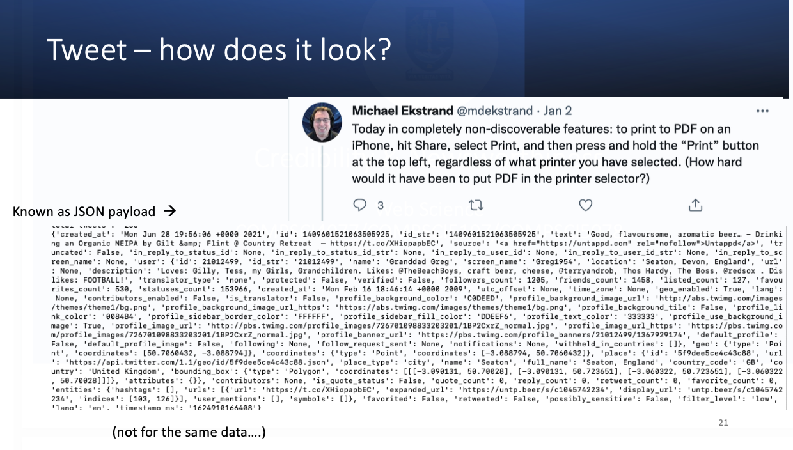

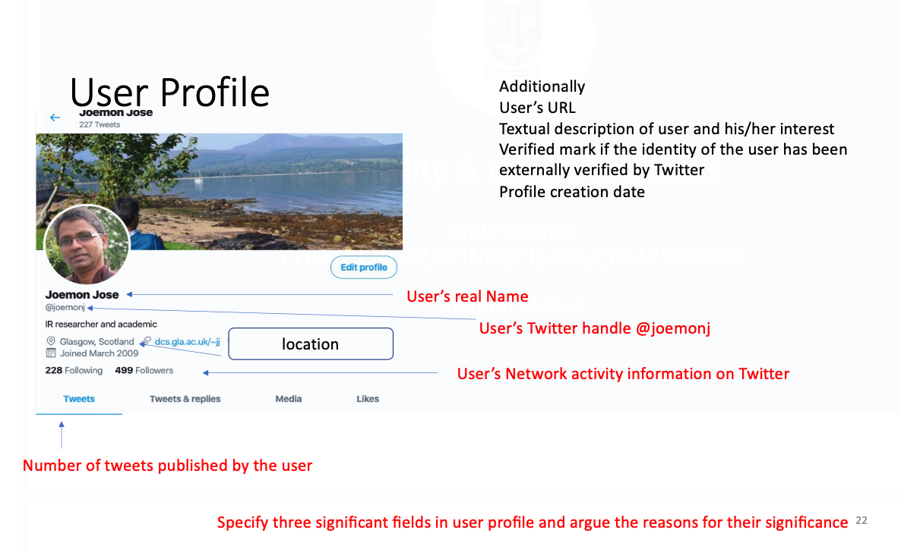


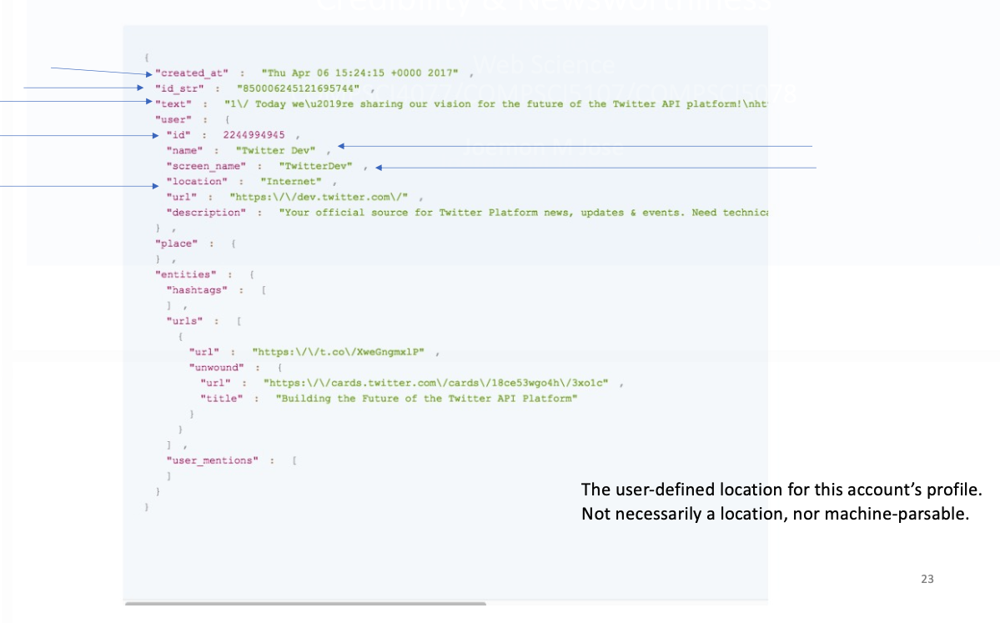

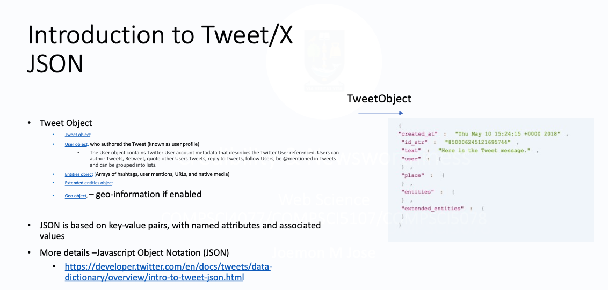

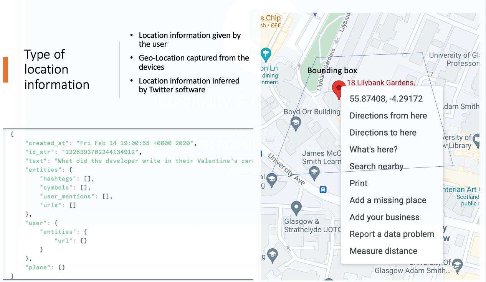

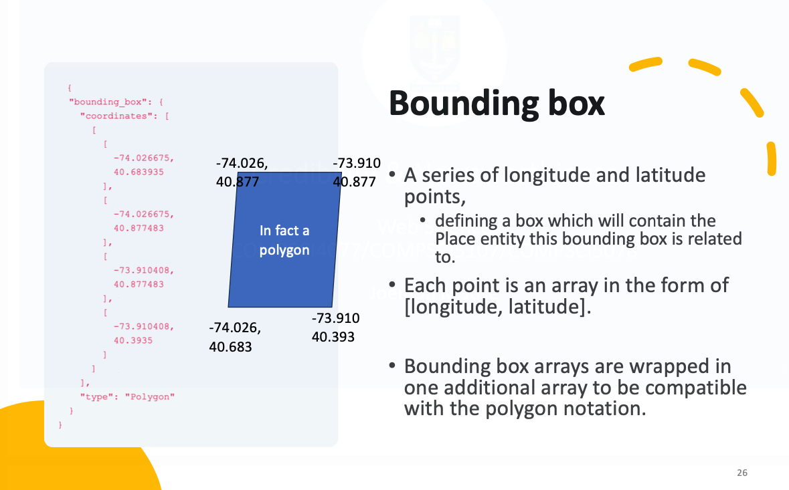

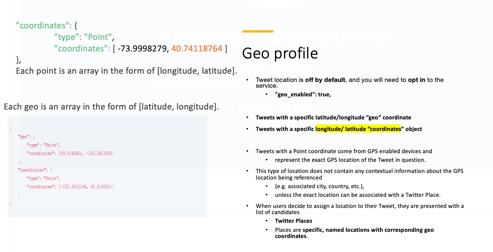

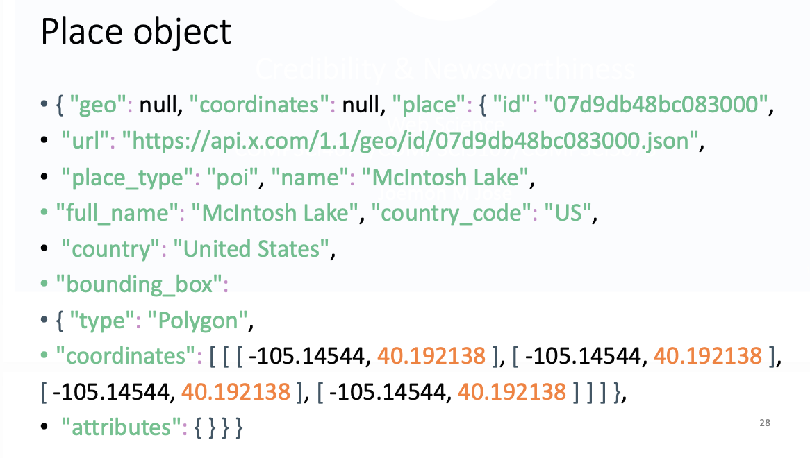

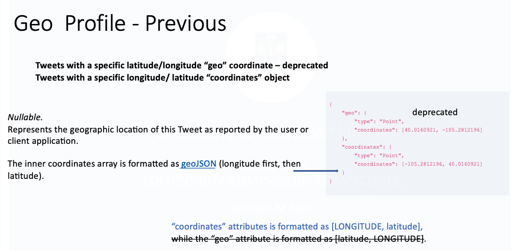

## Place Object

- Places are specific, named locations with corresponding geo-coordinates
- When users decide to assign a location to their Tweet, they are presented with a list of candidate Twitter Places
- When suing the API to post a Tweet, a Twitter Place can be attached b y specifying a place_id when posting the Tweet
- Tweets associated with Places are not necessarily issued from that location but could also potentially be about that location

### Detailed Place Object Example

```json
{
  "place": {
    "id": "1a2b3c4d5e6f7g8h",
    "url": "https://api.twitter.com/1.1/geo/id/1a2b3c4d5e6f7g8h.json",
    "place_type": "poi",
    "name": "Glasgow Central Station",
    "full_name": "Glasgow Central Station, Glasgow",
    "country_code": "GB",
    "country": "United Kingdom",
    "contained_within": [
      {
        "id": "0e8b2a4c5f6d7e8f",
        "place_type": "city",
        "name": "Glasgow",
        "full_name": "Glasgow, Scotland"
      }
    ],
    "bounding_box": {
      "type": "Polygon",
      "coordinates": [[
        [-4.2590, 55.8581],
        [-4.2590, 55.8599],
        [-4.2570, 55.8599],
        [-4.2570, 55.8581]
      ]]
    },
    "attributes": {
      "street_address": "Gordon Street",
      "locality": "Glasgow City Centre",
      "region": "Scotland",
      "iso3": "GBR"
    }
  }
}
```

**Explanation:**
- This is a detailed Place object for a point of interest (POI) - Glasgow Central Station
- `place_type`: "poi" indicates this is a specific point of interest rather than a city or country
- `contained_within`: Shows the hierarchical relationship (this POI is within Glasgow city)
- `bounding_box`: Provides precise geographical boundaries of the station
- `attributes`: Contains additional location details like street address and locality
- This level of detail is valuable for fine-grained geolocation analysis, allowing precise mapping of tweets to specific venues or landmarks

### Example: Tweet with Credibility Indicators for Geolocation

```json
{
  "created_at": "Sat Oct 14 15:30:22 +0000 2023",
  "id": 1583456789012345678,
  "id_str": "1583456789012345678",
  "text": "Major traffic accident on M8 eastbound near junction 15. Emergency services on scene. Expect delays. #TrafficScotland",
  "user": {
    "id": 34567890,
    "id_str": "34567890",
    "name": "Traffic Scotland Official",
    "screen_name": "trafficscotland",
    "location": "Scotland, UK",
    "description": "Official account for traffic updates in Scotland",
    "verified": true,
    "followers_count": 213456,
    "statuses_count": 45678,
    "created_at": "Mon Jan 15 10:00:00 +0000 2015"
  },
  "coordinates": {
    "type": "Point",
    "coordinates": [-4.2650, 55.8680]
  },
  "place": {
    "id": "0e8b2a4c5f6d7e8f",
    "place_type": "city",
    "name": "Glasgow",
    "full_name": "Glasgow, Scotland",
    "country_code": "GB",
    "country": "United Kingdom"
  },
  "geo_enabled": true,
  "source": "<a href=\"https://traffic.gov.uk\" rel=\"nofollow\">Traffic Scotland Web App</a>"
}
```

**Explanation:**
- This tweet contains several indicators that would contribute to high credibility for geolocation:
  - `user.verified`: True indicates this is an official verified account
  - `user.followers_count`: High number of followers (213,456) suggests authority
  - `user.description`: Identifies as an "Official account for traffic updates"
  - `source`: Posted from "Traffic Scotland Web App" rather than a general consumer app
  - `coordinates`: Contains precise location data
- When using weighted algorithms for geolocation analysis, tweets like this would receive higher credibility scores
- The combination of verified status, official source, and precise coordinates makes this tweet highly reliable for traffic incident detection

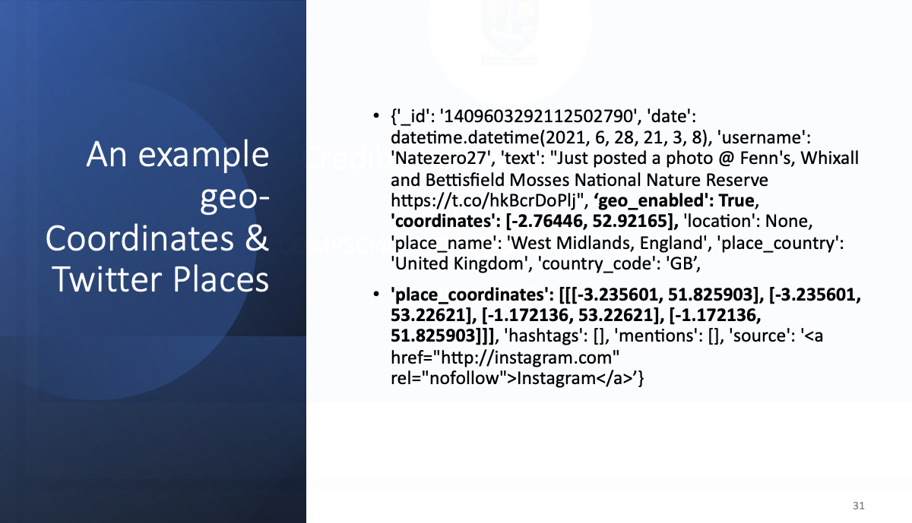

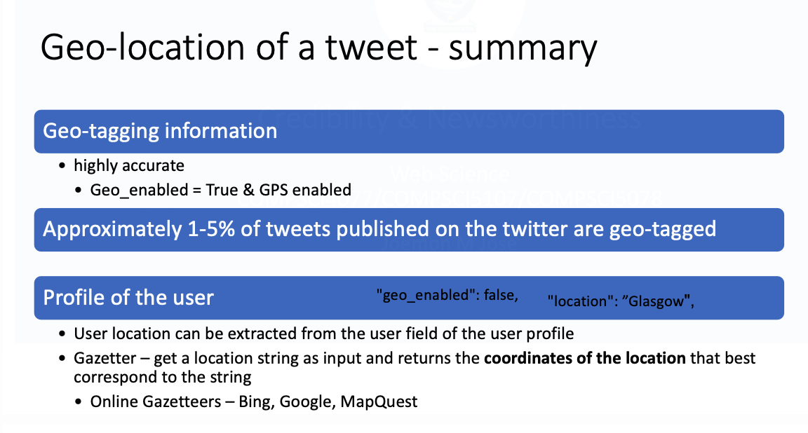

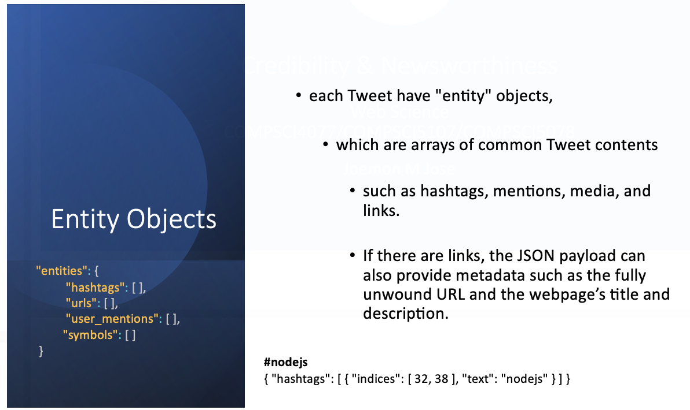

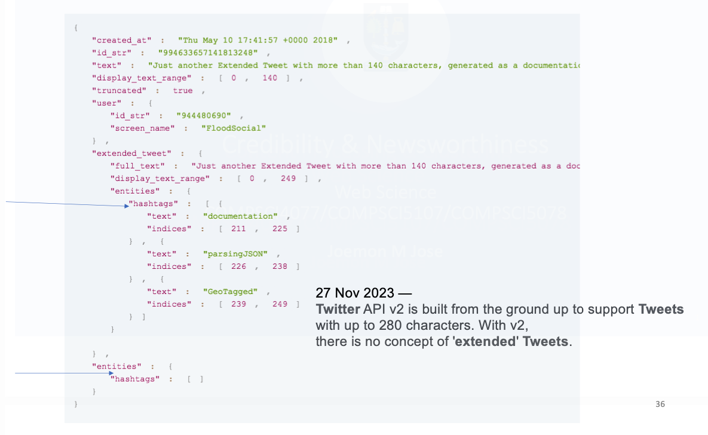

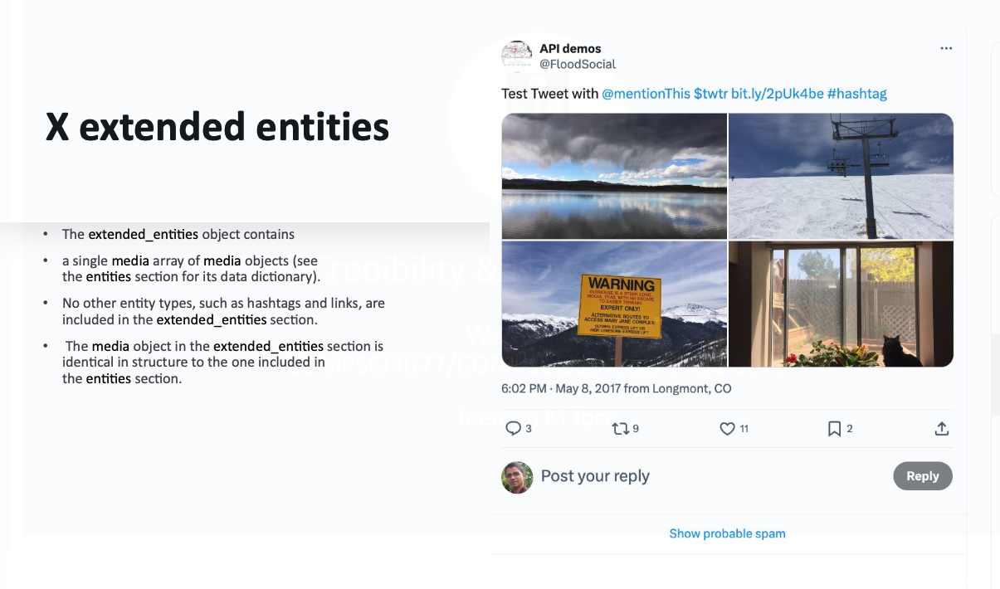

## Tutorial Questions and Answers

### Why do you think location information is important?
Location information is critically important for numerous applications:
- **Emergency response and disaster management**: Enables rapid identification of affected areas and coordination of resources during crises
- **Urban planning and infrastructure development**: Helps understand population movement patterns and service needs
- **Targeted marketing and business intelligence**: Allows businesses to reach relevant local audiences
- **Transportation and logistics optimization**: Facilitates route planning and traffic management
- **Public health monitoring**: Helps track disease spread and allocate healthcare resources
- **Social research and behavioral analysis**: Provides context for understanding human activities and interactions
- **Content personalization**: Enables delivery of location-relevant information to users

### What are the benefits of location information?
Location information provides several key benefits:
- **Contextual understanding**: Adds spatial dimension to data, making it more meaningful
- **Pattern recognition**: Reveals geographic trends and clusters that might otherwise be invisible
- **Predictive capabilities**: Enables forecasting based on spatial relationships and historical patterns
- **Resource optimization**: Allows for more efficient allocation of services and infrastructure
- **Enhanced user experiences**: Provides personalized, location-relevant content and services
- **Improved decision-making**: Offers critical spatial context for both operational and strategic decisions
- **Cross-domain insights**: Connects data from different sources based on shared geographic attributes

### How does Twitter encode location information \& their advantages and limitations?

Twitter encodes location information through several methods:

**Methods of Encoding:**
1. **Precise coordinates**: Exact latitude/longitude when users opt to share their precise location
2. **Place objects**: Named locations with defined boundaries (countries, cities, neighborhoods)
3. **User profile location**: Free-text field where users can enter their location
4. **Time zone information**: User's selected time zone
5. **Content-based location references**: Mentions of places within tweet text

**Advantages:**
- **Multiple granularity levels**: From precise coordinates to general regions
- **User control**: Users can choose how much location data to share
- **Structured data**: Place objects provide standardized location information
- **Contextual enrichment**: Adds geographic dimension to social media analysis
- **Real-time insights**: Provides location data for events as they unfold

**Limitations:**
- **Opt-in nature**: Only a small percentage of tweets contain precise coordinates
- **Accuracy issues**: User-provided location fields may contain inaccurate or fictional places
- **Inconsistent availability**: Not all tweets have associated location data
- **Privacy constraints**: API restrictions limit access to certain location data
- **Ambiguity**: Place mentions in text may be references rather than actual locations
- **Representativeness concerns**: Location-sharing users may not represent the broader population

### Summary of Twitter Geolocation Data

Twitter provides multiple layers of geographic information that vary in precision, reliability, and availability:

| Location Type | Precision | Availability | Reliability | Example |
|---------------|-----------|--------------|-------------|---------|
| Coordinates | Highest (exact point) | Lowest (~1-3%) | Very High | [-4.2333, 55.8500] |
| Place Objects | Medium (bounded area) | Medium (~10%) | High | "Glasgow, Scotland" |
| Profile Location | Varies (user-defined) | High (~70%) | Low | "Somewhere in cyberspace" |
| Text Mentions | Varies (requires NLP) | Medium | Medium | "near Buchanan Street" |

For effective geolocation analysis using Twitter data:
* Combine multiple location indicators when available
* Weight sources by reliability (coordinates > place > text mentions > profile)
* Consider user credibility (verified accounts, follower count, account age)
* Use contextual clues (mentioned landmarks, local terminology)
* Be aware of demographic biases in the data
* Apply appropriate privacy protections and ethical considerations

The choice between fine-grained (street/building level) and coarse-grained (city/region level) geolocation approaches should be guided by the specific application requirements, with emergency response and traffic monitoring typically benefiting from higher precision.

%20⭐⭐⭐⭐.png)

# Content Processing


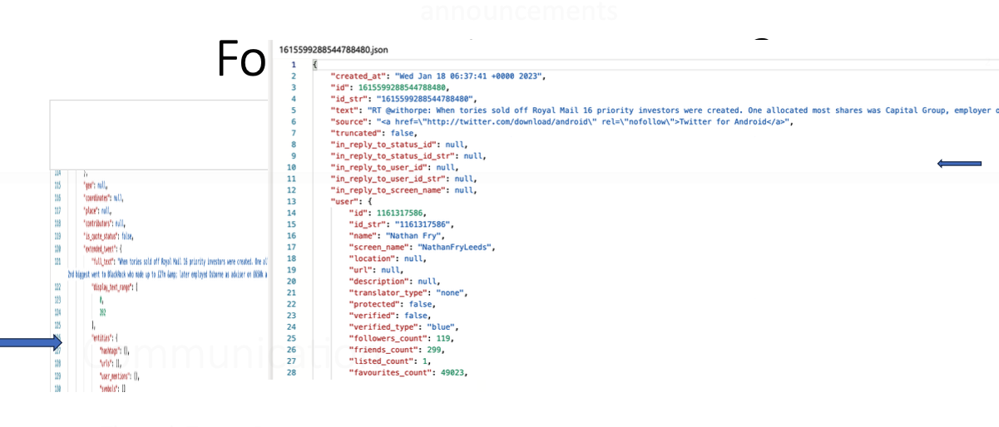

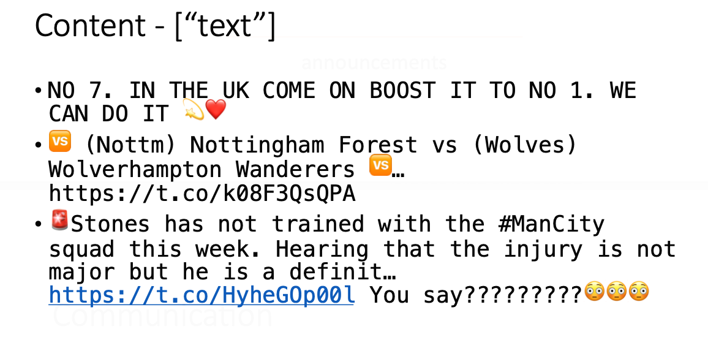

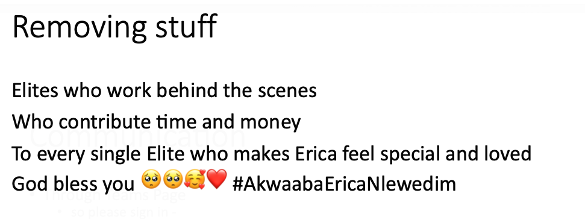

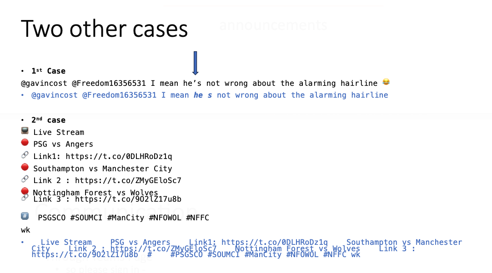

## Processing and Cleansing Social Media Data

From a data science perspective, processing social media data involves several critical steps to transform raw, unstructured content into analyzable information:

### Text Preprocessing Pipeline

1. **Data Collection and Extraction**
   - API-based collection (rate limits and sampling considerations)
   - Web scraping (ethical and legal considerations)
   - Historical data access limitations

2. **Basic Cleaning Operations**
   - Removing duplicate content
   - Handling missing values
   - Filtering out non-relevant content
   - Normalizing text encoding (UTF-8 standardization)

3. **Text Normalization**
   - Case normalization (typically lowercasing)
   - Punctuation removal or standardization
   - Whitespace normalization
   - Special character handling
   - URL standardization or removal

4. **Linguistic Processing**
   - Tokenization (word, sentence, n-gram)
   - Stop word removal (context-dependent)
   - Stemming and lemmatization
   - Part-of-speech tagging
   - Named entity recognition (identifying locations, organizations, people)

5. **Social Media-Specific Elements**
   - Hashtag segmentation (#ClimateChangeNow → Climate Change Now)
   - Username handling (@mentions)
   - Emoji interpretation and standardization
   - Handling platform-specific features (retweets, quote tweets)
   - Slang and abbreviation normalization

6. **ASCII Processing Considerations**
   - Converting non-ASCII characters to ASCII equivalents
   - Handling extended character sets
   - Detecting and managing encoding errors
   - ASCII art and special formatting removal
   - Control character filtering

7. **Feature Engineering**
   - Text vectorization (Bag-of-Words, TF-IDF, embeddings)
   - Sentiment analysis features
   - Temporal features (posting time, frequency)
   - Network-based features (user interactions)
   - Geographic feature extraction

8. **Quality Assessment**
   - Spam and bot content detection
   - Credibility scoring
   - Content relevance evaluation
   - Representativeness analysis
   - Bias identification

9. **Ethical Considerations**
   - Privacy protection (PII removal)
   - Demographic bias awareness
   - Context preservation
   - Source attribution
   - Responsible reporting of findings

10. **Data Storage and Documentation**
    - Structured storage formats (CSV, JSON, databases)
    - Processing pipeline documentation
    - Version control for datasets
    - Metadata preservation
    - Reproducibility considerations

The cleansing process must balance removing noise while preserving meaningful signal, especially considering the informal, abbreviated, and context-dependent nature of social media communication.

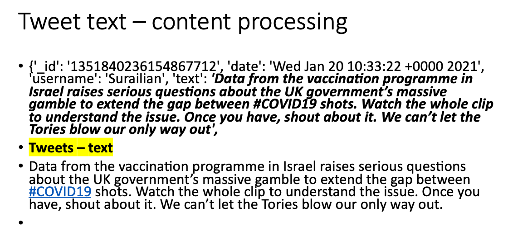

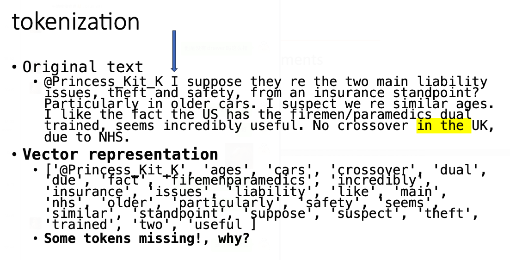

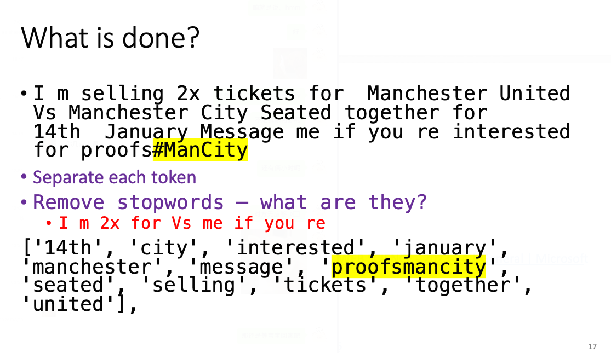

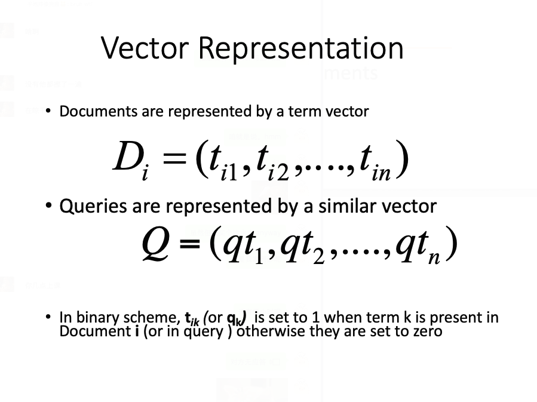

## Text Vector Representation

### Vector Space Model for Documents and Queries

Text vector representation is a fundamental concept in information retrieval and natural language processing that converts text documents into mathematical vectors for computational analysis:

- **Document Vectorization**: Each document is transformed into a numerical vector
  $$D_i = (t_{i1}, t_{i2}, \dots, t_{in})$$
  Where:
  - $D_i$ represents document i
  - Each element $t_{ij}$ represents the weight of term j in document i
  - n is the total number of unique terms in the collection

- **Query Vectorization**: Similarly, search queries are converted into the same vector space
  $$Q = (qt_1, qt_2, \dots, qt_n)$$
  Where:
  - Each element $qt_j$ represents the weight of term j in the query
  - The dimensionality matches the document vectors for direct comparison

### Binary Representation Approach

The simplest implementation uses binary weights:
- $t_{ik} = 1$ if term k appears in document i (regardless of frequency)
- $t_{ik} = 0$ if term k is absent from document i
- Similarly, $qt_k = 1$ if term k appears in the query, otherwise $qt_k = 0$

Example:
For the vocabulary ["glasgow", "traffic", "weather"], a tweet "Traffic in Glasgow" would be represented as:
$$D = (1, 1, 0)$$

This vector representation enables:
- Computing similarity between documents and queries using vector operations
- Clustering similar documents together
- Performing document classification
- Supporting geolocalisation by representing location terms in the vector space

More sophisticated weighting schemes like TF-IDF (Term Frequency-Inverse Document Frequency) extend this model by considering term frequency and importance.


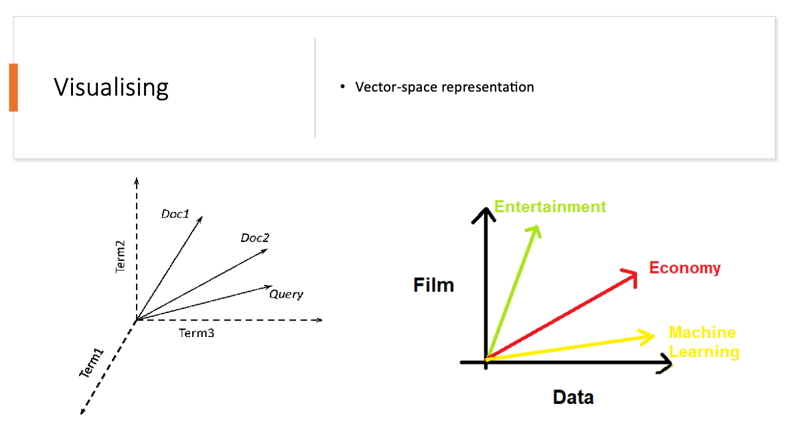

## Similar Documents

The most relevant documents for a query are expected to be those represented by the vectors closest to the query vector, meaning documents that use similar words to the query. This concept is fundamental to information retrieval and document similarity analysis.

Closeness is often calculated by examining the angles between document vectors and the query vector rather than the absolute distances. This approach normalizes for document length, ensuring that the similarity measure focuses on content overlap rather than document size.

We need a robust similarity measure to quantify this closeness, which is why cosine similarity is commonly used in text analysis.

## Cosine Similarity Measure

Cosine similarity measures the cosine of the angle between two vectors, providing a value between -1 and 1 (though with text data, values are typically between 0 and 1 since term weights are non-negative).

For a document vector D and query vector Q:

$$
D = (t_1, t_2, \dots, t_n)
$$

$$
Q = (qt_1, qt_2, \dots, qt_n)
$$

The cosine similarity is calculated as:

$$
\cos(D, Q) = \frac{\sum^n_{i=1}t_i \times qt_i}{\sqrt{\sum^n_{i=1}t_i^2} \times \sqrt{\sum^n_{i=1}qt_i^2}}
$$

Where:
- The numerator represents the dot product of the two vectors
- The denominator normalizes by the product of the vector magnitudes
- n is the number of dimensions (terms) in the vector space

The result indicates:
- 1: Vectors are identical (0° angle)
- 0: Vectors are orthogonal (90° angle)
- -1: Vectors point in opposite directions (180° angle)

Example:
For D = (1, 1, 0) and Q = (1, 0, 0):
$$
\cos(D, Q) = \frac{1 \times 1 + 1 \times 0 + 0 \times 0}{\sqrt{1^2 + 1^2 + 0^2} \times \sqrt{1^2 + 0^2 + 0^2}} = \frac{1}{\sqrt{2} \times 1} = \frac{1}{\sqrt{2}} \approx 0.707
$$

## Length of a Vector

The magnitude (or length) of a vector is its size, calculated using the Euclidean norm:

$$
\|V\| = \sqrt{\sum^n_{i=1}v_i^2}
$$

Where:
- $\|V\|$ denotes the magnitude of vector V
- $v_i$ is the value of the ith component
- n is the number of dimensions

Example:
For a vector V = (3, 4):
$$
\|V\| = \sqrt{3^2 + 4^2} = \sqrt{9 + 16} = \sqrt{25} = 5
$$

## Unit Vector

A unit vector has a magnitude of 1 while maintaining the same direction as the original vector. To normalize a vector (convert it to a unit vector):

For any vector $\vec{v}$, its unit vector $\hat{v}$ is calculated as:

$$
\hat{v} = \frac{\vec{v}}{\|\vec{v}\|}
$$

Where:
- $\vec{v}$ is the original vector
- $\|\vec{v}\|$ is the magnitude of the vector
- $\hat{v}$ is the resulting unit vector

Example:
For a vector $\vec{v} = (3, 4)$:
1. Calculate magnitude: $\|\vec{v}\| = \sqrt{3^2 + 4^2} = 5$
2. Normalize: $\hat{v} = (\frac{3}{5}, \frac{4}{5})$

In text analysis:
- If each term has weight 1, normalizing by $\frac{1}{\sqrt{n}}$ where n is the number of terms
- For a tweet with 19 terms, each term's normalized weight would be $\frac{1}{\sqrt{19}} \approx 0.229$

This normalization ensures that document length doesn't dominate similarity calculations, focusing instead on term distribution patterns.

## Similarity Computation

### Cosine Similarity

Cosine similarity measures the cosine of the angle between two vectors, providing a value between -1 and 1 (though in text analysis with non-negative weights, the range is typically 0 to 1). A value of 1 means the vectors are identical in direction, 0 means they are orthogonal (completely different), and -1 means they point in opposite directions.

### Similarity vs. Dissimilarity (Distance)

- **Similarity measures** increase as objects become more alike (cosine similarity, Jaccard similarity)
- **Dissimilarity measures** (or distances) increase as objects become more different (Euclidean distance, Manhattan distance)
- The relationship is often inverse: similarity = 1 - normalized_distance

### Working with Normalized Vectors:

- **Benefits are**:
  - Eliminates the influence of document length on similarity calculations
  - Makes documents comparable regardless of their size
  - Simplifies computational complexity
  - Focuses on term distribution patterns rather than absolute frequencies
- **Similarity can be computed just using sum of $t_i\times qt_i$** when vectors are normalized, as the denominator in the cosine similarity formula becomes 1

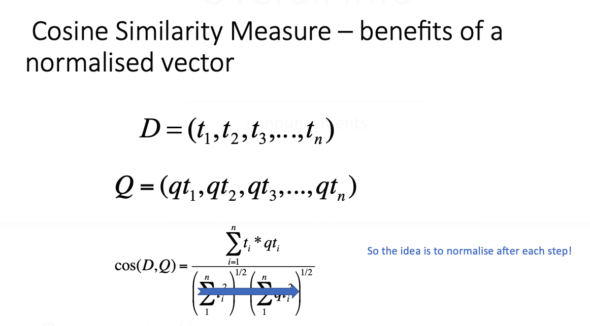

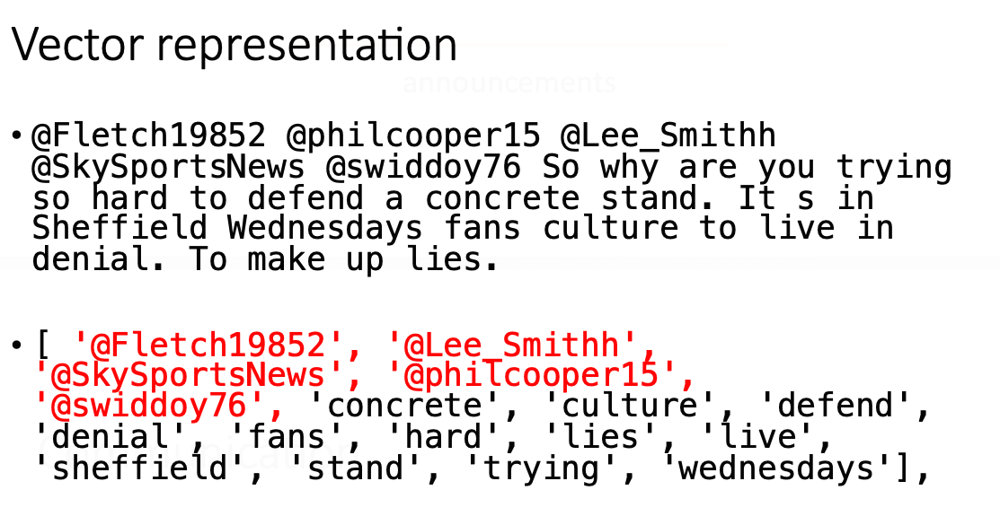

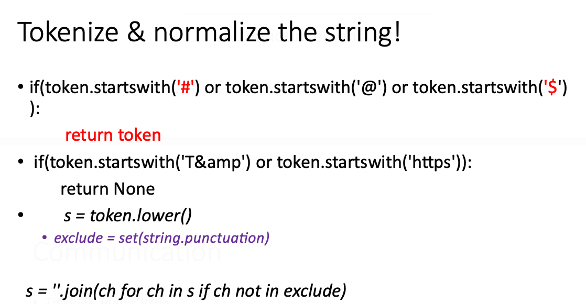

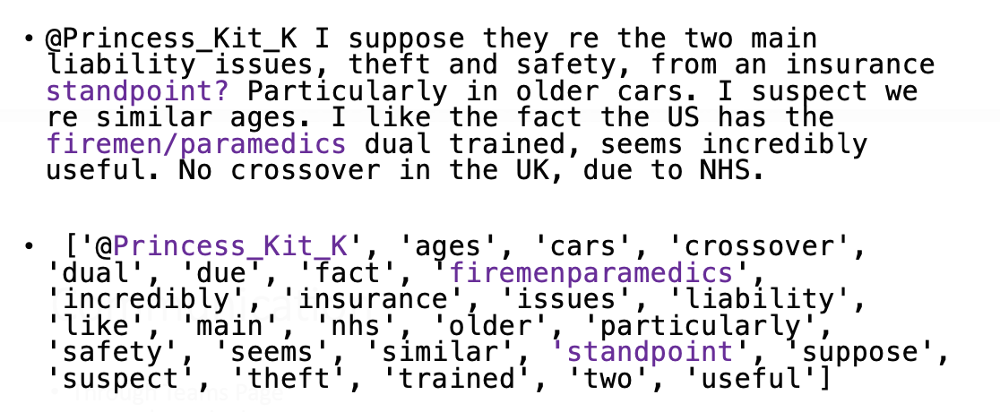

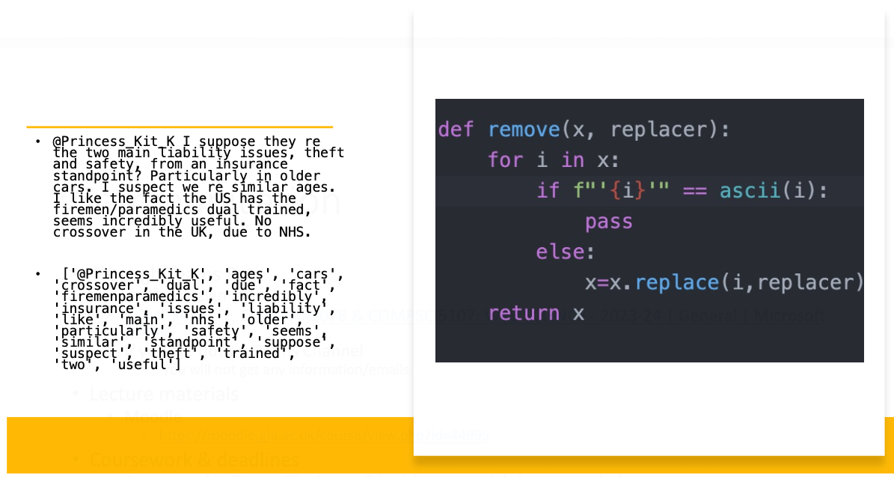

## Text Processing Pipeline

The text processing pipeline is a series of steps applied to raw text to transform it into a format suitable for computational analysis:

1. **Tokenization**: Breaking text into individual words or tokens. For example, "The cat sat on the mat" becomes ["The", "cat", "sat", "on", "the", "mat"].

2. **Normalization**: Converting text to lowercase, removing accents, and standardizing characters. This ensures consistency in analysis by treating "Cat" and "cat" as the same token.

3. **Stopword removal**: Eliminating common words with little semantic value (e.g., "the", "is", "and", "of") that occur frequently but contribute minimal meaning to the analysis.

4. **Stemming/Lemmatization**: Reducing words to their root forms.
   - Stemming: A heuristic process that chops off word endings (e.g., "running" → "run", "cats" → "cat")
   - Lemmatization: A more sophisticated approach using vocabulary and morphological analysis to return the base dictionary form (e.g., "better" → "good", "was" → "be")

5. **Feature extraction**: Converting processed text into numerical representations such as:
   - Bag-of-Words (BoW): Counting word occurrences
   - TF-IDF: Weighting terms by their importance
   - Word embeddings: Representing words as dense vectors in a continuous vector space

This systematic approach ensures consistency in text analysis and improves the quality of results in applications like search, classification, and clustering.

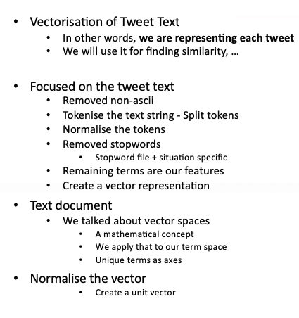

## Term Weighting

Term weighting is the process of assigning importance values to unique words (features) in a document, determining how significant each dimension is in the vector space model.

### In documents, such as web pages:
- If a word is repeated many times within a document, it generally indicates that the document focuses on that concept
- Repetition is considered a signal of importance
- Term frequency (TF) is often used as a basic weighting scheme, defined as:

$$TF(t,d) = \frac{\text{Number of times term } t \text{ appears in document } d}{\text{Total number of terms in document } d}$$

- More sophisticated approaches like TF-IDF (Term Frequency-Inverse Document Frequency) balance term frequency with how common the term is across all documents:

$$TF\text{-}IDF(t,d,D) = TF(t,d) \times IDF(t,D)$$

Where IDF is calculated as:

$$IDF(t,D) = \log\frac{\text{Total number of documents in corpus } D}{\text{Number of documents containing term } t}$$

### However, in tweets and short social media posts:
- Words are rarely repeated due to the limited character count (typically 280 characters for Twitter)
- The binary presence of a term is often more meaningful than its frequency
- We typically assume all present words are equally important
- If a word appears in the tweet, that dimension becomes active (value of 1) in the underlying vector representation
- This binary representation works well for short text classification and clustering, and can be formalized as:

$$weight(t,d) = \begin{cases} 
1 & \text{if term } t \text{ appears in document } d \\
0 & \text{otherwise}
\end{cases}$$

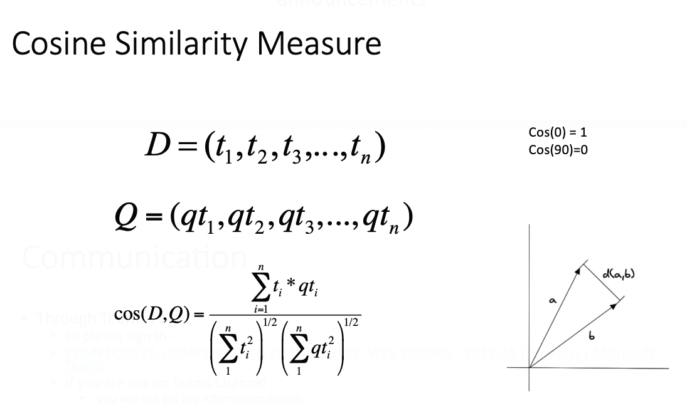

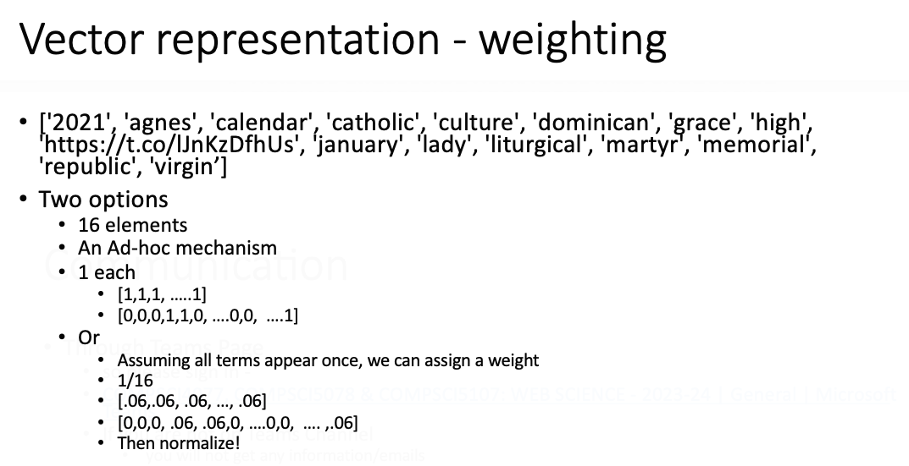

## Finding similar tweets

### What is a cluster?

In General Usage:
- A cluster is simply a collection or group of similar things located close together: Example: a cluster of grapes, buildings, or ideas
- In our context:
  - A group of similar tweets grouped together based on certain characteristics or features
  - Tweets sharing common words, topics, or semantic meaning
  - Documents that are close to each other in the vector space representation
  
### Clustering in Text Analysis
- Clustering organizes tweets into meaningful groups without predefined categories (unsupervised learning)
- Each cluster contains tweets that are more similar to each other than to tweets in other clusters
- Similarity is typically measured using distance metrics like cosine similarity in the vector space
- The goal is to maximize intra-cluster similarity while minimizing inter-cluster similarity, which can be expressed mathematically as:
  - Maximize: $\sum_{i=1}^{k} \sum_{x \in C_i} similarity(x, \mu_i)$ where $\mu_i$ is the centroid of cluster $C_i$
  - Minimize: $\sum_{i=1}^{k} \sum_{j=1, j \neq i}^{k} similarity(\mu_i, \mu_j)$ for all pairs of cluster centroids

### Applications of Tweet Clustering
- Topic detection: Identifying emerging topics or trends in social media
- Event detection: Recognizing real-world events based on sudden clusters of related tweets
- Information summarization: Condensing large volumes of tweets into representative groups
- Anomaly detection: Identifying outliers that don't fit well into any cluster
- Geographic analysis: Finding location-based patterns when combined with geolocation data


## Single-pass clustering
- Requires a single, sequential pass over the set of documents it attempts to cluster
- The idea is to group similar documents (tweets) as and when they arrive: sequential nature
- The algorithm classifies a document (the next one) in the sequence
  - Based on the current set of clusters and
  - According to a condition on the similarity function employed
  
- At every stage, the algorithm decides on whether a newly seen document should become a member of an already defined cluster or the center of a new one
  - In its most simple form, the similarity function gets defined based on
  - Just some similarity (or alternatively, dissimilarity) measure
  - Between document-feature vectors
- Cosine similarity is commonly used, defined as:

$$similarity(A, B) = \cos(\theta) = \frac{A \cdot B}{||A|| \times ||B||} = \frac{\sum_{i=1}^{n} A_i B_i}{\sqrt{\sum_{i=1}^{n} A_i^2} \times \sqrt{\sum_{i=1}^{n} B_i^2}}$$

Where $A$ and $B$ are the vector representations of two documents.

## Cluster centroid

Given a set of documents (tweets) in a cluster $C = \{D_1, D_2, ..., D_n\}$:
- We take the average of the vector representation as a representation of the cluster/group
- The centroid $\mu_C$ is calculated as:

$$\mu_C = \frac{1}{|C|} \sum_{D \in C} D$$

Where:
- $|C|$ is the number of documents in cluster $C$
- $D$ is the vector representation of a document

Remember, we are grouping based on the content representation:
- Hence, we assume the documents are similar
- In terms of word similarity and hence
- Semantic similarity

Cluster centroid is the representation of group/cluster:
- Think of it as a "virtual document" that represents the average content of all documents in the cluster
- It may not correspond to any actual document in the cluster, but serves as an abstract representation of the cluster's central theme

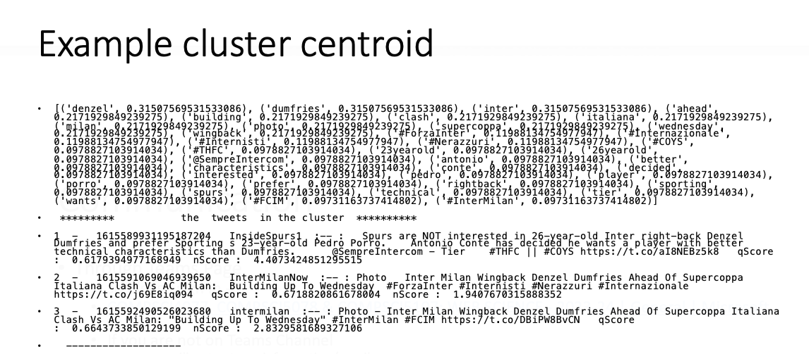

## Stream of tweets

Twitter generates approximately 500 million tweets per day (about 6,000 tweets per second). These tweets arrive one after another in a continuous stream.

We want to cluster them as they arrive, which presents several challenges:
- Limited memory: Cannot store all tweets in memory
- Real-time processing: Need to make decisions quickly
- Evolving topics: Clusters may change over time
- One-pass constraint: Cannot revisit all previous tweets

## Single Pass Clustering Steps

The general algorithm is as follows:
1. Step 1
   1. Assign the first document $D_1$ as the representative of the first cluster $C_1$
   2. Document vector becomes the cluster vector/centroid
2. Step 2
   1. For each incoming document $D_i$, calculate the similarity $S$ with the representative for each existing cluster
   2. Document vector $D_i$ is compared to each cluster centroid
      1. We need a cluster centroid - or an average representation of documents in the cluster
   3. Let $S_{max}$ be the maximum similarity between the incoming document and any existing cluster:
      $$S_{max} = \max_{j} \{similarity(D_i, \mu_{C_j})\}$$
3. Step 3
   1. If $S_{max}$ is greater than a predefined threshold value $S_{T}$
      1. Add the item to the corresponding cluster $C_j$ -> we need to make sure the similarity is substantial
      2. Recalculate the cluster representative (centroid):
         $$\mu_{C_j}^{new} = \frac{|C_j| \times \mu_{C_j}^{old} + D_i}{|C_j| + 1}$$
   2. Otherwise, use $D_i$ to initiate a new cluster $C_{k+1}$ where $k$ is the current number of clusters
4. Step 4
   1. For a new item $D_{i+1}$ to be clustered, return to step 2

## How to group tweets

The key components for effective tweet clustering are:

1. **Cosine similarity**: Measures the angle between two document vectors, providing a value between -1 and 1 (though with non-negative weights, the range is typically 0 to 1).

2. **Similarity Threshold** ($S_T$): A critical parameter that determines when to create a new cluster versus adding to an existing one. Typically set between 0.3 and 0.7, depending on:
   - Desired granularity of clusters
   - Nature of the data
   - Specific application requirements

The threshold can be determined empirically through experimentation or by domain knowledge.

## Comments

The single pass method is particularly simple (and useful in this scenario):
   - It requires that the dataset be processed only once
   - It handles data as it arrives (streaming)
   - It has O(nk) time complexity, where n is the number of documents and k is the number of clusters

Obviously, the results for this method are highly dependent:
- On the similarity threshold that is used
- The order in which documents are processed


## Comments & Observations

It tends to produce large clusters early in the clustering pass:
- The clusters formed are not independent of the order in which the dataset is processed
  - Because similar documents arriving in different order would create different clusters
  - You should use your judgment in setting the threshold so that you are left with a reasonable number of clusters
- Post-processing tips:
  - Use to form the groups initially, which are used to reallocate/create new clusters
  - If we get large noisy clusters of tweets, we could re-cluster them
  - Consider periodic rebalancing of clusters to improve quality

## Moving average

Moving average is a calculation technique used to analyze data points by creating a series of averages of different subsets of the full dataset. In the context of clustering tweets, moving averages can help adapt to evolving topics and trends.

The simple moving average (SMA) of a cluster centroid can be calculated as:

$$\mu_{C,t} = \frac{1}{w} \sum_{i=t-w+1}^{t} D_i$$

Where:
- $\mu_{C,t}$ is the centroid at time t
- $w$ is the window size (number of recent documents to consider)
- $D_i$ represents the document vectors in the cluster

The exponential moving average (EMA) gives more weight to recent documents:

$$\mu_{C,t} = \alpha \times D_t + (1-\alpha) \times \mu_{C,t-1}$$

Where:
- $\alpha$ is the smoothing factor (typically between 0.1 and 0.3)
- $D_t$ is the newest document
- $\mu_{C,t-1}$ is the previous centroid

How moving averages affect our clusters:

1. **Temporal relevance**: Recent tweets have more influence on cluster representation
2. **Drift adaptation**: Clusters can gradually shift to follow evolving topics
3. **Noise reduction**: Smooths out random fluctuations in cluster centroids
4. **Memory efficiency**: Only need to store the current centroid and smoothing parameters, not all historical tweets
5. **Concept decay**: Older content gradually loses influence, reflecting the natural lifecycle of topics on social media

By incorporating moving averages, the clustering algorithm becomes more responsive to current trends while maintaining computational efficiency in a streaming environment.

%20⭐⭐⭐⭐.png)

## Credibility & Newsworthiness Notes

### 1. Defining Credibility in Social Media

- **Source Credibility**: The perceived trustworthiness and expertise of the information source
  - User verification status (blue checkmark)
  - Account age and consistency
  - Follower count and engagement metrics
  - Prior accuracy record

- **Content Credibility**: The believability of the information itself
  - Internal consistency
  - External corroboration
  - Specificity and detail level
  - Evidence presentation (photos, links, citations)

- **Contextual Credibility**: How credible the information appears in a specific context
  - Temporal relevance (recency)
  - Geographic proximity to events
  - Expertise relevance to topic
  - Network confirmation (retweets by other credible sources)

### 2. Calculating Credibility Scores

Credibility can be quantified through weighted formulas:

$$\text{Credibility}(\text{User}) = w_1 \times \text{ActivityScore} + w_2 \times \text{RelevanceScore} + w_3 \times \text{VerificationScore} + w_4 \times \text{HistoricalAccuracyScore} + w_5 \times \text{AccountAgeScore}$$

Where:
- ActivityScore: Frequency and consistency of posting
- RelevanceScore: Topic-specific expertise
- VerificationScore: Official verification status (binary or scaled)
- HistoricalAccuracyScore: Prior accuracy of information
- AccountAgeScore: Age and establishment of account

**Normalization approach**:
```
NormalizedCredibility(User) = (Credibility(User) - MinCredibility) / (MaxCredibility - MinCredibility)
```

### 3. Newsworthiness Factors

Newsworthiness is determined by:

- **Timeliness**: Recency of information
  - Breaking news receives higher scores
  - First reports of events have special significance

- **Impact/Significance**: Potential effect on population
  - Number of people affected
  - Severity of consequences
  - Duration of impact

- **Proximity**: Geographic or cultural relevance
  - Local events for local audiences
  - Cultural significance to target community

- **Prominence**: Involvement of well-known entities
  - Public figures
  - Major organizations
  - Famous locations

- **Unexpectedness**: Surprise or novelty value
  - Unusual events
  - Unexpected developments
  - Statistical outliers

- **Conflict**: Presence of controversy or tension
  - Disputes between parties
  - Competing narratives
  - Social or political divisions

### 4. Credibility-Weighted Geolocation

For geolocation using credibility weights:

1. **Basic approach**:
   ```python
   def predict_location_with_credibility(query_tweet, reference_tweets, user_credibility):
       location_scores = {}
       for tweet in reference_tweets:
           similarity = calculate_similarity(query_tweet, tweet)
           credibility = user_credibility.get(tweet.user_id, 0.5)  # Default to 0.5 if unknown
           location = tweet.location
           
           if location not in location_scores:
               location_scores[location] = 0
           
           # Weight the vote by both similarity and credibility
           location_scores[location] += similarity * credibility
       
       return max(location_scores, key=location_scores.get)
   ```

2. **Formula**:
   ```
   Score(Location_i) = Σ(Similarity(Q, Tj) × Credibility(Tj) × I(Tj, Location_i))
   ```
   Where:
   - Q is the query tweet
   - Tj is the jth retrieved tweet
   - I(Tj, Location_i) is an indicator function (1 if tweet Tj is from Location_i, 0 otherwise)

### 5. Credibility Indicators in Twitter Data

- **User Verification**: Official verified accounts (✓)
- **Follower Count**: High follower numbers suggest authority
- **Account Description**: Official status claims that can be verified
- **Content Consistency**: Consistent topic focus
- **External Links**: Links to credible websites
- **Media Attachments**: Photographic evidence
- **Source Application**: Posts from official organization apps

### 6. Relationship Between Credibility and Accuracy

- Credibility ≠ Accuracy (credible sources can be wrong)
- Higher credibility correlates with higher accuracy probability
- Credibility serves as a useful proxy when ground truth is unavailable
- Credibility should be continually reassessed based on performance

### 7. Key Takeaways

- Credibility is multi-dimensional and context-dependent
- Newsworthiness affects what information gets shared and amplified
- Weighted approaches using credibility improve geolocation accuracy
- Balancing multiple credibility factors is crucial for robust systems
- Credibility assessment must account for demographic and platform biases
- Implementing credibility in algorithms requires both technical and ethical considerations


---


## Online Brand Communities: Hate and Conflict Analysis Notes

### 1. Foundational Definitions

- **Online Brand Community (OBC)**: A specialized, non-geographically bound, digital collective based on structured social relationships among admirers of a brand, characterized by a shared consciousness, rituals, traditions, and moral responsibility toward fellow members and the brand itself.
  - *Formal definition*: "A virtual social aggregation that emerges when sufficient people with emotional attachment to a commercial entity engage in public online interactions centered on brand affiliation, creating networks of relationships with identifiable boundaries." 

- **Hate Speech**: Content that promotes violence against, directly attacks, or dehumanizes individuals or groups based on protected attributes such as race, ethnicity, gender, religion, sexual orientation, disability, or serious disease.
  - *Technical definition*: "Public communication that expresses extreme dislike or hostility toward a person or group of people because of a characteristic they share, or a position they hold, utilizing derogatory language that has the potential to encourage discrimination, hostility, or violence." 

- **Online Conflict**: A state of discord caused by the actual or perceived opposition of needs, values, interests, or communication patterns between brand community members or between community members and external entities.
  - *Operational definition*: "A sustained sequence of contentious digital interactions characterized by increased emotional intensity, persisting beyond a single exchange, and exhibiting clear opposing positions." 

### 2. Typology of Online Brand Communities

1. **Consumer-initiated vs. Brand-initiated**
   - *Consumer-initiated*: Organically formed by brand enthusiasts (e.g., unofficial subreddits)
   - *Brand-initiated*: Officially created and moderated by the brand organization (e.g., official Facebook pages)

2. **Engagement-level Classification**
   - *Transactional communities*: Focused on information exchange and problem-solving
   - *Relational communities*: Emphasizing emotional connections and identity formation
   - *Transformational communities*: Aiming to create social impact beyond consumption

3. **Platform Architecture Types**
   - *Centralized communities*: Single-platform focused (e.g., dedicated forums)
   - *Distributed communities*: Spread across multiple platforms (e.g., hashtag communities)
   - *Hybrid communities*: Combining official and unofficial spaces

### 3. Conflict Detection and Analysis Framework

- **Lexical Indicators of Conflict**
   - Profanity density: Ratio of profane words to total words
   - Negative sentiment intensity: Strength of negative emotion expressions
   - Imperative commands: Use of directives in communication
   - Disagreement markers: Words signaling opposition (e.g., "but," "however," "actually")

- **Social Network Analysis Indicators**
   - *Conflict networks*: Networks where edges represent hostile interactions
   - *Community polarization*: Formation of distinct oppositional subgroups
   - *Conflict centrality*: Tendency of certain nodes to be involved in conflicts
   - *Mathematical formula*: Conflict Centrality (CC) of node i = Σ(conflict_weight(i,j)) / (n-1) where j ranges over all other nodes

- **Temporal Patterns of Conflict**
   - Escalation curves: Rate at which linguistic hostility increases
   - Cyclical patterns: Recurring conflict around specific triggers
   - Contagion effects: Spread of conflict to initially uninvolved members
   - Resolution timelines: Duration from initiation to de-escalation

### 4. Hate Speech Detection Methodologies

1. **Computational Approaches**
   - *Rule-based systems*: Using predefined lexicons and linguistic rules
   - *Machine learning classifiers*: Supervised learning with labeled training data
     * Feature extraction → Classification → Post-processing
   - *Deep learning methods*: Neural networks for contextual understanding
     * Word embeddings (e.g., Word2Vec, GloVe)
     * Transformer models (e.g., BERT, RoBERTa)
   - *Multimodal analysis*: Combining text, image, and metadata signals

2. **Performance Metrics**
   - Precision: Ratio of true positives to all predicted positives
   - Recall: Ratio of true positives to all actual positives
   - F1 Score: Harmonic mean of precision and recall
   - Area Under ROC Curve (AUC): Discrimination ability at various thresholds

3. **Challenges in Detection**
   - *Contextual ambiguity*: Same words can be hateful or non-hateful depending on context
   - *Evolving language*: Emergence of new coded language to evade detection
   - *Cultural specificity*: Variation in what constitutes hate across cultures
   - *Class imbalance*: Relatively low prevalence of hate speech in most datasets

### 5. Brand Community Conflict Dynamics

- **Conflict Trajectory Model**
   1. *Latent phase*: Underlying tensions without overt expression
   2. *Triggering event*: Specific incident catalyzing open conflict
   3. *Escalation phase*: Increasing hostility and participant involvement
   4. *Stalemate phase*: Entrenched positions with continued hostility
   5. *De-escalation phase*: Gradual reduction in conflict intensity
   6. *Resolution/transformation phase*: Return to community equilibrium or restructuring

- **Conflict Participant Roles**
   - *Instigators*: Members who initiate conflicts (high out-degree in conflict networks)
   - *Amplifiers*: Members who escalate existing conflicts (high betweenness centrality)
   - *Mediators*: Members who attempt to resolve conflicts (bridging structural holes)
   - *Spectators*: Members who observe without active participation (peripheral nodes)

- **Brand Response Strategies**
   1. *Avoidance*: Non-engagement with conflictual content
   2. *Accommodation*: Adapting to demands from conflicting parties
   3. *Competition*: Asserting authority to control the narrative
   4. *Collaboration*: Working with community to find mutually beneficial solutions
   5. *Compromise*: Finding middle ground between opposing positions

### 6. Methodological Approaches to Studying Brand Community Conflict

1. **Data Collection Methods**
   - *API-based scraping*: Using platform APIs to collect posts and interactions
   - *Custom crawlers*: Programmatic collection of publicly available data
   - *Longitudinal tracking*: Monitoring communities over extended periods
   - *Event-triggered collection*: Intensified data gathering during crisis events

2. **Analytical Techniques**
   - *Content analysis*: Systematic coding of textual and visual material
   - *Discourse analysis*: Examination of language patterns and power relations
   - *Network analysis*: Mapping relationship structures and interaction patterns
   - *Sentiment analysis*: Quantifying emotional valence in community content
   - *Topic modeling*: Identifying recurring themes in community discourse

3. **Mixed Methods Approaches**
   - *Sequential explanatory design*: Quantitative analysis followed by qualitative interpretation
   - *Concurrent triangulation*: Simultaneous collection of quantitative and qualitative data
   - *Embedded design*: One method nested within the predominant approach

### 7. Impact of Conflict on Brand Communities

- **Community Level Effects**
   - *Membership turnover*: Rate at which members leave during/after conflicts
   - *Participation inequality*: Concentration of activity among fewer members
   - *Trust erosion*: Decreased willingness to share personal information
   - *Community fragmentation*: Formation of splinter groups or subcultures

- **Brand Level Effects**
   - *Reputation damage*: Negative perception among existing and potential customers
   - *Engagement volatility*: Unpredictable fluctuations in community interaction
   - *Resource drain*: Increased moderation and management requirements
   - *Strategic uncertainty*: Difficulty in planning community initiatives

- **Quantification Approaches**
   - *Brand sentiment index*: Composite measure of sentiment across platforms
   - *Community health metrics*: Growth rate, retention rate, engagement quality
   - *Conflict incidence rate*: Conflicts per 1,000 interactions
   - *Resolution effectiveness*: Percentage of conflicts successfully mediated

### 8. Ethical Considerations and Governance

1. **Ethical Frameworks for Intervention**
   - *Harm reduction*: Minimizing negative impacts while preserving dialogue
   - *Free speech balancing*: Weighing expression rights against community harm
   - *Care ethics*: Prioritizing relationships and well-being over abstract principles
   - *Distributive justice*: Ensuring fair treatment across community segments

2. **Governance Models**
   - *Top-down moderation*: Centralized control by brand representatives
   - *Community self-governance*: Member-led regulation through established norms
   - *Algorithmic governance*: Automated content filtering and moderation
   - *Hybrid approaches*: Combining human judgment with algorithmic assistance

3. **Intervention Strategies**
   - *Pre-emptive*: Community guidelines, onboarding education, norm-setting
   - *Real-time*: Content filtering, cooling-off periods, interaction limitations
   - *Reactive*: Content removal, member warnings, temporary/permanent bans
   - *Restorative*: Mediation processes, community dialogue, reconciliation forums

---


## LLM Methods and Prompting Notes

### 1. Foundational Definitions and Models

- **Large Language Model (LLM)**: 
  > "Statistical models built using deep learning techniques that can process and generate natural language text by predicting the probability of sequences of words based on patterns learned from massive training corpora." 
  - Characterized by their parameter size (typically billions to trillions)
  - Trained on vast corpora of text data (hundreds of billions of tokens)
  - Capable of performing various language tasks without explicit task-specific training

- **Transformer Architecture**:
  > "A neural network architecture that relies entirely on self-attention mechanisms to draw global dependencies between input and output, replacing recurrent layers entirely with multi-headed self-attention operations." 
  - **Formal components**:
    * Self-attention layers that compute representations of input sequences
    * Feed-forward neural networks that process these representations
    * Residual connections and layer normalization for training stability

- **Foundation Model**:
  > "A model trained on broad data at scale that can be adapted (fine-tuned) to a wide range of downstream tasks, exhibiting emergent capabilities that are not explicitly programmed or anticipated by its creators." 
  - Serves as the basis for multiple downstream applications
  - Exhibits transfer learning capabilities across domains
  - Shows emergent abilities at scale not present in smaller models

- **Prompt Engineering**:
  > "The practice of designing, refining, and optimizing inputs to language models to elicit desired outputs, requiring an understanding of how these models process and respond to different formulations of queries or instructions." 
  - Bridges user intent and model capabilities
  - Leverages model knowledge without modifying weights
  - Systematically structures inputs for optimal responses

### 2. LLM Architectures and Taxonomy

1. **Architecture-based Classification**
   - **Decoder-only models**:
     > "Neural network architectures that process input tokens sequentially, conditioning each prediction on all previously observed tokens, making them particularly suited for text generation tasks." 
     * Examples: GPT series, LLaMA, Claude
     * Primary use: Text generation and completion

   - **Encoder-only models**:
     > "Models that transform input sequences into contextual representations without an auto-regressive generation component, optimized for understanding rather than generation." 
     * Examples: BERT, RoBERTa
     * Primary use: Text classification, sentiment analysis

   - **Encoder-decoder models**:
     > "Dual-component architectures where the encoder processes the input sequence into a representation, which the decoder then uses to generate output sequences, creating a bridge between understanding and generation." 
     * Examples: T5, BART, PaLM
     * Primary use: Translation, summarization, question-answering

2. **Scale-based Taxonomy**
   - Small (< 1B parameters): DistilBERT, BERT-base
   - Medium (1B-10B parameters): T5-large, GPT-Neo
   - Large (10B-100B parameters): LLaMA-13B, Claude Instant
   - Massive (>100B parameters): GPT-4, PaLM, Claude Opus

3. **Training Paradigm Classification**
   - **Supervised Fine-Tuning (SFT)**:
     > "The process of adapting a pre-trained language model on a curated dataset with input-output pairs that demonstrate the desired behavior, typically involving optimization of a maximum likelihood objective." 

   - **Reinforcement Learning from Human Feedback (RLHF)**:
     > "A training methodology that aligns language models with human preferences by learning a reward model from human comparisons of outputs and using reinforcement learning to optimize the model toward these learned preferences." 

   - **Direct Preference Optimization (DPO)**:
     > "A training approach that directly optimizes language model outputs to match human preferences without explicitly modeling a reward function, simplifying the RLHF pipeline while achieving comparable alignment." 

### 3. Prompting Methodologies and Frameworks

1. **Basic Prompting Types**
   - **Zero-shot prompting**:
     > "The practice of eliciting desired outputs from a language model by providing instructions or queries without any examples, relying solely on the model's pre-trained knowledge." 
     * Example: "Translate the following English text to French: 'Hello, how are you?'"

   - **Few-shot prompting**:
     > "A technique that provides a small number of input-output examples within the prompt itself to establish a pattern that the model should follow for the target query." 
     * Example: "English: Hello. French: Bonjour. English: Good morning. French: Bon matin. English: How are you? French:"

   - **Chain-of-thought (CoT) prompting**:
     > "A prompting method that encourages the model to generate intermediate reasoning steps before providing a final answer, leading to improved performance on complex reasoning tasks." 
     * Example: "To solve 13 × 25, I'll multiply 3 × 25 = 75, then multiply 10 × 25 = 250, and finally add 75 + 250 = 325."

2. **Advanced Prompting Techniques**
   - **Self-consistency**:
     > "A decoding strategy that samples multiple reasoning paths through chain-of-thought prompting and selects the most consistent answer, improving accuracy on reasoning tasks." 

   - **ReAct prompting**:
     > "A framework that interleaves reasoning traces and task-specific actions in a synergistic manner to enable language models to interact with external environments for solving tasks." 

   - **Tree of Thoughts (ToT)**:
     > "A search framework that generalizes chain-of-thought prompting by exploring multiple reasoning paths through a language model, using self-evaluation to deliberate on different intermediate steps." 

3. **Prompt Engineering Principles**
   - **Specificity principle**: Detailed and specific prompts yield more targeted outputs
   - **Context window utilization**: Structure prompts to effectively use available context
   - **Role assignment**: Specifying the role the model should assume affects response quality
   - **Instruction clarity**: Clear, step-by-step instructions improve task completion
   - **System prompts**: Establishing global behavior guidelines for the entire conversation

### 4. LLM Evaluation Methodologies

1. **Performance Metrics**
   - **Perplexity**:
     > "A measure of how well a probability model predicts a sample, calculated as the exponentiated average negative log-likelihood of a sequence." 
     * Formula: PPL = exp(-1/N * Σ log P(xi))
     * Lower values indicate better prediction capability

   - **BLEU score** (for generation tasks):
     > "An algorithm for evaluating the quality of text that has been translated from one language to another, based on the precision of n-gram matches between the candidate and reference translations." 

   - **Accuracy, F1, Precision, Recall** (for classification tasks)

2. **Evaluation Frameworks**
   - **HELM** (Holistic Evaluation of Language Models):
     > "A framework for rigorous evaluation of language models across multiple dimensions, including accuracy, calibration, robustness, fairness, bias, toxicity, and efficiency." 

   - **MMLU** (Massive Multitask Language Understanding):
     > "A benchmark designed to measure a language model's multitask accuracy across 57 subjects spanning humanities, STEM, and social sciences at varying difficulty levels." 

   - **LLM-as-a-judge**:
     > "An evaluation methodology where one language model is prompted to assess the quality of another language model's outputs according to specified criteria, enabling scalable evaluation of generative capabilities." 

3. **Evaluation Challenges**
   - **Hallucination assessment**:
     > "The measurement of a model's tendency to generate content that appears plausible but is factually incorrect or unsupported by the provided context or world knowledge." 

   - **Jailbreak susceptibility testing**:
     > "The systematic evaluation of a model's vulnerability to prompts designed to circumvent safety guardrails, allowing assessment of safety mechanism robustness." 

   - **Emergent capability evaluation**:
     > "Methods for detecting and measuring abilities that appear in larger models but are absent in smaller ones, suggesting non-linear scaling properties in language model capabilities." 

### 5. Applications in Web Science

1. **Social Media Analysis Applications**
   - **Content moderation**:
     > "The application of LLMs to identify and filter problematic content on social platforms, including hate speech, harassment, misinformation, and illegal material." 

   - **Conversation summarization**:
     > "Using LLMs to distill lengthy social media threads, comments, or discussions into concise summaries while preserving key points and perspectives." 

   - **Trend detection and analysis**:
     > "Employing LLMs to identify emerging topics, analyze sentiment patterns, and extract insights from social media discourse across platforms." 

2. **Web Information Extraction**
   - **Structured data extraction**:
     > "The process of using LLMs to convert unstructured web content into structured formats by identifying and categorizing entities, relationships, and attributes." 

   - **Semantic search enhancement**:
     > "Augmenting search systems with LLMs to understand query intent, expand keywords, and rank results based on semantic relevance rather than lexical matching." 

   - **Multimodal content understanding**:
     > "Using LLMs in conjunction with vision models to comprehend and contextualize web content that combines text, images, and other media types." 

3. **Web Accessibility and Interface Design**
   - **Adaptive interfaces**:
     > "LLM-powered systems that dynamically modify web interfaces based on user needs, preferences, and contexts to enhance accessibility and usability." 

   - **Content simplification and adaptation**:
     > "Techniques for using LLMs to reformulate complex web content for different reading levels, technical backgrounds, or cognitive needs." 

### 6. Prompt Engineering for Social Media Research

1. **Data Collection Prompting**
   - **Synthetic data generation**:
     > "Using LLMs to create diverse, realistic social media content that can supplement real data for training classifiers, testing hypotheses, or evaluating systems." 

   - **Query formulation**:
     > "Leveraging LLMs to generate comprehensive search queries that capture the various ways users might discuss a topic on social platforms." 

2. **Analysis Prompting Strategies**
   - **Multi-perspective analysis**:
     > "Structured prompting techniques that direct LLMs to analyze social media content from multiple stakeholder viewpoints, ideological positions, or cultural contexts." 

   - **Temporal comparison prompting**:
     > "Methods for prompting LLMs to analyze how social media discourse on specific topics has evolved over time, identifying shifts in language, concerns, or sentiment." 

   - **Counterfactual reasoning prompts**:
     > "Techniques for eliciting LLM analysis of how social media narratives might have developed under different circumstances or interventions." 

3. **Framework: PLASMA Prompting Method**
   > "A structured approach to social media analysis prompting that encompasses Problem definition, Lens specification, Analysis parameters, Scope definition, Methodology articulation, and Assessment criteria." 
   - **Components**:
     * Problem: Clear statement of research question
     * Lens: Theoretical framework or perspective
     * Analysis: Type of analysis required
     * Scope: Dataset boundaries and limitations
     * Methodology: Analytical approach
     * Assessment: Evaluation criteria for outputs

### 7. Ethical and Methodological Considerations

1. **Reliability Concerns**
   - **Hallucination management**:
     > "Strategies to detect, prevent, or mitigate the tendency of LLMs to generate factually incorrect information that appears plausible, particularly critical in research applications." 

   - **Prompt sensitivity**:
     > "The phenomenon where minor changes in prompt wording can significantly alter LLM outputs, creating challenges for research reproducibility and reliability." 

   - **Methodological transparency**:
     > "The practice of fully documenting prompt design processes, iterations, and rationales to enable scientific reproducibility in LLM-based research." 

2. **Ethical Frameworks for LLM Research**
   - **TRACE framework**:
     > "An ethical framework for LLM research encompassing Transparency in prompting, Reproducibility of results, Accountability for outputs, Consent considerations, and Equity implications." 

   - **Dual-review process**:
     > "A methodological approach requiring both human and automated evaluation of LLM outputs used in research to ensure quality, accuracy, and ethical compliance." 

3. **Bias and Fairness**
   - **Prompt fairness testing**:
     > "The systematic evaluation of how prompts might elicit or amplify biases in LLM outputs across demographic groups or ideological perspectives." 

   - **Controlled demographic representation**:
     > "Techniques for ensuring balanced representation of diverse groups when using LLMs to generate or analyze social media content." 

---


## Machine Learning and Deep Learning Applications Notes

### 1. Foundational Definitions and Concepts

- **Machine Learning (ML)**:
  > "A field of study that gives computers the ability to learn without being explicitly programmed, where learning is defined as improving performance on a specific task with experience." 
  - Characterized by algorithms that improve through experience
  - Relies on patterns and inference rather than explicit instructions
  - Performance typically improves with more high-quality data

- **Deep Learning (DL)**:
  > "A subfield of machine learning based on artificial neural networks with representation learning, where multiple layers of nonlinear processing units are used for feature extraction and transformation." 
  - Distinguished by its use of neural networks with many layers
  - Capable of learning hierarchical representations of data
  - Excels at discovering intricate structures in high-dimensional data

- **Neural Network**:
  > "Computational models inspired by the human brain's structure and function, consisting of interconnected nodes (neurons) that process information using a connectionist approach to computation." 
  - Fundamental components include neurons, weights, activation functions, and layers
  - Can approximate virtually any function with sufficient complexity
  - Learns by adjusting weights through backpropagation

- **Supervised Learning**:
  > "A machine learning paradigm where models are trained on labeled data pairs (input and desired output), learning a function that maps inputs to outputs, which can then be used to predict outputs for unseen inputs." 
  - Requires annotated datasets with input-output pairs
  - Common tasks include classification and regression
  - Performance measured against known ground truth labels

### 2. Deep Learning Architectures for Social Media Analysis

1. **Convolutional Neural Networks (CNNs)**
   > "Neural networks that use convolution operations in at least one of their layers, designed to automatically and adaptively learn spatial hierarchies of features from input data." 
   - **Applications in social media**:
     * Image classification and object detection in shared media
     * Hate speech detection in memes and multimodal content
     * Classification of informative images during crisis events
   - **Key components**:
     * Convolutional layers for feature extraction
     * Pooling layers for dimensionality reduction
     * Fully connected layers for classification

2. **Recurrent Neural Networks (RNNs) and Variants**
   > "Neural networks designed to recognize patterns in sequences of data by maintaining an internal state (memory) that captures information about previous inputs in the sequence." 
   - **LSTM (Long Short-Term Memory)**:
     > "A special kind of RNN designed to avoid the long-term dependency problem by introducing a memory cell that can maintain information for long periods of time." 
   - **GRU (Gated Recurrent Unit)**:
     > "A gating mechanism in recurrent neural networks similar to LSTM but with fewer parameters, using update and reset gates to solve the vanishing gradient problem." 
   - **Applications in social media**:
     * Sentiment analysis in tweet sequences
     * Temporal event detection and tracking
     * User behavior modeling over time

3. **Transformer-Based Architectures**
   > "Neural network architectures based on self-attention mechanisms that weight the influence of different parts of the input data, eliminating the need for recurrence and enabling more parallelizable training." 
   - **Social media applications**:
     * Cross-platform content analysis
     * Multilingual social media monitoring
     * Context-aware stance detection

4. **Graph Neural Networks (GNNs)**
   > "Deep learning methods designed to perform inference on data described by graphs, capturing the dependence of nodes through message passing between the nodes of the graph." 
   - **Types**:
     * Graph Convolutional Networks (GCN)
     * Graph Attention Networks (GAT)
     * GraphSAGE (Sample and Aggregate)
   - **Social media applications**:
     * Social network analysis and influence prediction
     * Community detection in interaction graphs
     * Information diffusion modeling
     * Fake news detection using propagation patterns

### 3. Machine Learning for Social Media Tasks

1. **Text Classification and NLP**
   - **Sentiment Analysis**:
     > "The computational study of people's opinions, sentiments, emotions, and attitudes expressed in text towards entities such as products, services, organizations, individuals, issues, events, and topics." 
     * Formula: Sentiment Polarity = Σ(wi × si) / n
       where wi is the weight of term i, si is its sentiment score, and n is the number of terms
     * Methods range from lexicon-based to deep learning approaches

   - **Topic Modeling**:
     > "Unsupervised statistical methods that analyze words in texts to discover themes and group similar documents, providing both a content model and a discourse model." 
     * Latent Dirichlet Allocation (LDA)
     * Non-negative Matrix Factorization (NMF)
     * BERTopic (combining BERT embeddings with traditional clustering)

   - **Hate Speech and Toxicity Detection**:
     > "The automated identification of abusive language expressing prejudice against protected characteristics, using computational methods ranging from simple keyword matching to complex contextual understanding." 
     * Challenges include contextual understanding, evolving language, and cultural differences
     * Performance metrics include precision, recall, F1-score, and ROC-AUC

2. **Image and Multimodal Analysis**
   - **Visual Content Classification**:
     > "The process of categorizing images based on their content, using features extracted directly from pixel data through representation learning techniques." 
     * Transfer learning approaches with pre-trained models (ResNet, EfficientNet)
     * Fine-tuning strategies for social media-specific tasks

   - **Multimodal Fusion Techniques**:
     > "Methods for combining information from multiple modalities (text, image, video, metadata) to perform tasks that benefit from cross-modal understanding." 
     * Early fusion: combining raw features
     * Late fusion: combining decisions from unimodal models
     * Hybrid fusion: integrating at multiple levels of abstraction

3. **Social Network Analysis with ML**
   - **Link Prediction**:
     > "The task of predicting the existence of a link between two entities in a network, based on the attributes of the objects and other observed links." 
     * Formula: Score(x,y) = Σ f(common_neighbors, x, y) + g(path_features, x, y) + h(node_attributes, x, y)
     * Applications in connection recommendation and community evolution prediction

   - **Community Detection**:
     > "The task of identifying groups of nodes in a network that are more densely connected internally than with the rest of the network, revealing functional modules or social structures." 
     * Traditional algorithms: Louvain, InfoMap, Girvan-Newman
     * ML-enhanced approaches: embedding-based clustering, GNN-based detection
     * Evaluation metrics: modularity, conductance, normalized mutual information

   - **Influence Maximization**:
     > "The algorithmic problem of finding a small subset of nodes in a social network that maximizes the spread of influence under a specific diffusion model." 
     * Mathematical formulation: arg max|S|=k f(S), where f(S) is the expected influence spread of seed set S
     * ML approaches for identifying optimal seed sets in complex networks

### 4. Deep Learning for Event Detection and Monitoring

1. **Crisis Event Detection**
   > "The automated identification of emergency situations, natural disasters, or other crisis events from social media streams using machine learning techniques." 
   - **Methodological approaches**:
     * Supervised classification of crisis-related content
     * Unsupervised anomaly detection for emerging crises
     * Semi-supervised learning with active human-in-the-loop systems
   - **Key challenges**:
     * Class imbalance (crisis events are rare)
     * Temporal dynamics (rapidly evolving situations)
     * Multilinguality and cross-cultural understanding
     * Verification of information authenticity

2. **Temporal and Spatial Pattern Recognition**
   > "The identification of recurring patterns or anomalies in social media activity across time and geographic space, enabling early detection of evolving situations." 
   - **Techniques**:
     * Temporal convolutional networks for sequence modeling
     * Spatio-temporal graph neural networks
     * Point process models (e.g., Hawkes processes) for event cascades
   - **Mathematical formulation**:
     * Spatio-temporal intensity function: λ(t,s) = μ(s) + Σ g(t-ti, s-si)
       where μ(s) is the background rate and g is a triggering kernel

3. **Real-time Social Media Analysis Pipelines**
   > "End-to-end systems that continuously ingest, process, analyze, and visualize social media data streams to support decision-making during evolving situations." 
   - **Architectural components**:
     * Data collection and filtering modules
     * Feature extraction and representation learning
     * Classification and clustering engines
     * Visualization and alerting systems
   - **Performance considerations**:
     * Throughput vs. accuracy tradeoffs
     * Concept drift and model updating strategies
     * Scalability with volume fluctuations

### 5. Methodological Challenges and Solutions

1. **Data Challenges**
   - **Class Imbalance**:
     > "The situation in machine learning where the classes in a classification problem are not equally represented, leading to biased models that favor the majority class." 
     * Solutions:
       * Resampling techniques (oversampling, undersampling)
       * Synthetic data generation (SMOTE, ADASYN)
       * Cost-sensitive learning
       * Focal loss (γ-adjusted cross-entropy): FL(pt) = -(1-pt)^γ log(pt)

   - **Noisy Labels**:
     > "The presence of incorrect class assignments in training data, which can degrade model performance and lead to overfitting." 
     * Robust learning approaches:
       * Loss function modifications (symmetric cross entropy)
       * Sample selection (identifying and removing mislabeled examples)
       * Label cleaning techniques (confident learning)

   - **Distribution Shifts**:
     > "Changes in the statistical properties of data over time, leading to degraded model performance when deployment distributions differ from training distributions." 
     * Detection methods: Maximum Mean Discrepancy (MMD), CORAL distance
     * Adaptation strategies: domain adaptation, transfer learning, continual learning

2. **Modeling Techniques**
   - **Transfer Learning**:
     > "A machine learning technique where knowledge gained during training in one type of problem is leveraged to improve generalization in another related problem." 
     * Formal definition: Given a source domain DS with task TS and a target domain DT with task TT, transfer learning aims to improve learning in TT using knowledge from DS and TS
     * Applications: Using pre-trained models on general web text for specific social media analysis tasks

   - **Few-Shot Learning**:
     > "Learning approaches designed to generalize effectively from very few labeled examples per class, leveraging prior knowledge and inductive biases." 
     * Techniques:
       * Metric-based (Siamese networks, Prototypical networks)
       * Optimization-based (MAML, Reptile)
       * Data augmentation strategies

   - **Self-Supervised Learning**:
     > "A learning paradigm where supervisory signals are derived from the data itself without requiring explicit human annotations." 
     * Pretext tasks:
       * Masked language modeling
       * Next sentence prediction
       * Image rotation prediction
     * Applications in leveraging massive unlabeled social media data

3. **Evaluation Frameworks**
   - **Beyond Standard Metrics**:
     > "Evaluation approaches that go beyond accuracy, precision, and recall to assess model performance on dimensions like fairness, robustness, and calibration." 
     * Fairness metrics:
       * Disparate impact: P(Ŷ=1|A=0)/P(Ŷ=1|A=1)
       * Equal opportunity: P(Ŷ=1|Y=1,A=0) = P(Ŷ=1|Y=1,A=1)
       * Where A is a protected attribute and Ŷ is the predicted label

   - **Human-in-the-Loop Evaluation**:
     > "Evaluation processes that incorporate human judgment to assess model outputs on subjective dimensions or for complex tasks where gold standards are insufficient." 
     * Direct assessment protocols
     * Comparative ranking systems
     * Error analysis frameworks

### 6. Applications in Social Media Research

1. **Misinformation and Fake News Detection**
   > "The application of machine learning to identify false or misleading information spreading on social media platforms, considering content, network, and temporal features." 
   - **Multi-level approach**:
     * Content-level features (linguistic patterns, emotional appeal, factual inconsistency)
     * Source-level features (credibility, verification status, history)
     * Network-level features (propagation patterns, echo chambers)
     * User-interaction features (engagement ratios, commenting patterns)
   - **Mathematical model**:
     * Credibility score = α·content_score + β·source_score + γ·network_score + δ·user_score
       where α, β, γ, and δ are learned weights

2. **User Behavior Modeling**
   > "The application of machine learning to understand, predict, and model how users interact with social media platforms, other users, and content over time." 
   - **Engagement prediction**:
     * Forecasting user interactions (likes, shares, comments)
     * Identifying factors that drive viral content
   - **Behavior sequences**:
     * Modeling user journeys through sequential pattern mining
     * Identifying typical pathways toward certain behaviors (radicalization, purchase intent)

3. **Public Health Monitoring**
   > "The application of machine learning to social media data for monitoring, tracking, and predicting public health concerns, including disease outbreaks, mental health trends, and health misinformation." 
   - **Disease surveillance**:
     * Early warning systems for outbreak detection
     * Symptom tracking and prevalence estimation
   - **Mental health assessment**:
     * Detecting linguistic markers of depression, anxiety, or suicidal ideation
     * Tracking population-level mental health trends during crises

### 7. Ethical and Responsible ML for Social Media

1. **Fairness and Bias Mitigation**
   > "The identification and correction of systematic errors in machine learning systems that result in unfair treatment of certain groups, particularly those defined by protected attributes." 
   - **Bias types**:
     * Selection bias: Non-representative sampling of social media data
     * Representation bias: Skewed feature representations across groups
     * Evaluation bias: Testing on non-diverse datasets
   - **Mitigation strategies**:
     * Pre-processing: Data rebalancing, fair representation learning
     * In-processing: Constraint optimization, adversarial debiasing
     * Post-processing: Threshold adjustment, calibration methods

2. **Interpretability and Explainability**
   > "The ability to explain or present machine learning decisions in human-understandable terms, critical for transparency, trust, and accountability in social media analysis." 
   - **Inherently interpretable models**:
     * Decision trees
     * Rule-based systems
     * Linear/logistic regression with regularization
   - **Post-hoc explanation methods**:
     * Local explanations: LIME, SHAP
     * Global explanations: Partial dependence plots, SHAP summary plots
     * Counterfactual explanations: "What would need to change for the prediction to be different?"

3. **Privacy-Preserving Machine Learning**
   > "Techniques that enable machine learning on social media data while protecting individual privacy, often through formal privacy guarantees or data minimization approaches." 
   - **Differential privacy**:
     > "A formal guarantee that the inclusion or exclusion of any single individual in a dataset will not significantly affect the outcome of any analysis on that dataset." 
     * Formula: Pr[M(D1) ∈ S] ≤ exp(ε) × Pr[M(D2) ∈ S]
       where D1 and D2 are adjacent datasets differing in one record, M is the algorithm, and S is any subset of possible outputs
   - **Federated learning**:
     > "A machine learning approach where models are trained across multiple devices or servers holding local data samples, without exchanging them." 
     * Applications in privacy-preserving social media analytics across platforms or regions

---


## Emotion Analysis Notes

### 1. Foundational Definitions and Theoretical Frameworks

- **Emotion**:
  > "A complex psychological state that involves three distinct components: a subjective experience, physiological response, and behavioral or expressive response." 
  - Distinguished from mood (longer-lasting, less intense)
  - Characterized by valence (positive/negative) and arousal (level of intensity)
  - Functions as an adaptive response to environmental stimuli

- **Sentiment Analysis vs. Emotion Analysis**:
  > "While sentiment analysis typically focuses on polarity classification (positive, negative, neutral), emotion analysis aims to detect and classify specific emotional states (joy, anger, fear, etc.) expressed in content, requiring finer-grained understanding of affective language." 
  - Sentiment: General orientation (positive/negative/neutral)
  - Emotion: Specific affective states (happiness, sadness, fear, anger, etc.)
  - Comparison:
    * Sentiment is broader, emotions are more specific
    * Emotions provide more nuanced understanding of user states
    * Emotions better capture human experience complexity

- **Emotion Classification Models**
  
  1. **Basic Emotions Model (Ekman)**:
     > "A theoretical framework positing that humans universally experience and recognize six basic emotions: happiness, sadness, fear, disgust, anger, and surprise." 
     - Characterized by distinct facial expressions
     - Cross-cultural recognition
     - Biological and evolutionary basis

  2. **Dimensional Models (Valence-Arousal-Dominance)**:
     > "A framework conceptualizing emotions as points in a continuous multidimensional space rather than discrete categories, typically including dimensions of valence (pleasure-displeasure), arousal (activation-deactivation), and sometimes dominance (control-lack of control)." 
     - Valence: Pleasant to unpleasant
     - Arousal: Calm to excited
     - Dominance: Feeling in control to feeling controlled
     - Mathematical representation: E = f(v, a, d) where E is emotion, v is valence, a is arousal, d is dominance

  3. **Plutchik's Wheel of Emotions**:
     > "A psychoevolutionary classification approach organizing emotions into eight primary bipolar emotions (joy vs. sadness, anger vs. fear, trust vs. disgust, surprise vs. anticipation) arranged as four pairs of opposites, with varying intensities and combinations forming complex emotions." 
     - Primary emotions can combine to form complex emotions
     - Intensity dimension represented by depth
     - Adjacent emotions can blend (e.g., joy + trust = love)

### 2. Computational Approaches to Emotion Detection

1. **Lexicon-Based Methods**
   > "Approaches that detect emotions in text by matching words or phrases against pre-compiled dictionaries of terms associated with specific emotional states, often with corresponding intensity scores." 
   - **Emotion lexicons**:
     * NRC Emotion Lexicon: 14,000+ words mapped to Plutchik's eight emotions
     * EmoLex: Multi-language emotion associations
     * LIWC (Linguistic Inquiry and Word Count): Psychological dimensions including emotions
   - **Calculation formula**:
     ```
     EmotionScore(text, emotion) = Σ(word_i × emotion_weight_i) / n
     ```
     where word_i is a match in the lexicon and n is the number of words in text
   - **Advantages and limitations**:
     * Advantages: Interpretable, no training data required, computationally efficient
     * Limitations: Misses context, sarcasm, negation; limited vocabulary coverage

2. **Machine Learning Approaches**
   - **Traditional ML approaches**:
     > "Supervised learning methods that extract lexical, syntactic, and semantic features from text to train classifiers capable of recognizing emotional content based on labeled examples." 
     * Feature engineering approaches:
       - Bag-of-words, TF-IDF representations
       - N-grams and part-of-speech patterns
       - Syntactic and dependency features
     * Classification algorithms:
       - Support Vector Machines (SVMs)
       - Random Forests
       - Gradient Boosting methods
     * Performance metrics: Precision, recall, F1-score, macro/micro averaging

   - **Deep Learning models**:
     > "Neural network architectures that learn hierarchical representations of emotional content directly from data, often capturing complex linguistic patterns and semantic relationships." 
     * Common architectures:
       - CNNs for feature extraction
       - RNNs/LSTMs/GRUs for sequential processing
       - Attention mechanisms for focusing on emotion-relevant words
       - Transformer models (BERT, RoBERTa) with emotion fine-tuning
     * Transfer learning approaches:
       - Pre-trained language models adapted to emotion tasks
       - Multi-task learning with related affective tasks
     * State-of-the-art performance comparison:
       - Transformer-based models typically achieve F1 scores of 0.70-0.85 on benchmark datasets
       - Performance varies by emotion (happiness typically easiest, disgust and fear often hardest)

3. **Multimodal Emotion Recognition**
   > "Techniques that combine multiple information channels (text, audio, visual, physiological) to detect emotions, mirroring how humans perceive emotional states through multiple cues." 
   - **Modalities in social media**:
     * Text: Content, stylistic features, emojis
     * Images: Facial expressions, color schemes, visual symbols
     * Audio (in videos): Prosodic features, voice quality
     * Metadata: Temporal patterns, interaction signals
   - **Fusion strategies**:
     * Early fusion: Feature-level integration
     * Late fusion: Decision-level integration
     * Hybrid fusion: Multi-level integration
   - **Challenges**:
     * Alignment across modalities
     * Missing modality handling
     * Modality importance weighting

### 3. Emotion Analysis in Social Media

1. **Platform-Specific Considerations**
   - **Twitter/X emotion analysis**:
     > "The computational extraction of emotional states from short-form messages, considering platform-specific features like hashtags, emojis, and character limitations that affect emotional expression." 
     * Character limitations influence emotion expression
     * Hashtags often serve as emotional labels (#happy, #frustrated)
     * Temporal dynamics (real-time emotional reactions)

   - **Facebook/Instagram**:
     > "Emotion analysis approaches tailored to platforms with richer media content and social connections, often incorporating reaction data, images, and comment threads." 
     * Reaction buttons provide explicit emotion signals
     * Longer content allows for emotional narratives
     * Strong social context influences expression

   - **Reddit/Forum communities**:
     > "Methods for analyzing emotions in community-oriented platforms characterized by threaded discussions, specialized vocabularies, and strong group norms." 
     * Community-specific emotional norms and language
     * Threaded conversations show emotion evolution
     * Subreddit context influences interpretation

2. **Social Signals and Context**
   - **Social context factors**:
     * Conversation structure (replies, threads)
     * Community norms and expectations
     * Audience and self-presentation concerns
     * Temporal context (current events, trends)

   - **Contextual emotion analysis**:
     > "Approaches that consider the broader conversational, social, and temporal context in which emotional expressions occur, rather than analyzing isolated utterances." 
     * Methods:
       - Conversation modeling for emotion flows
       - User modeling for individual baselines
       - Topic-emotion associations

3. **Temporal Emotion Dynamics**
   - **Emotion tracking over time**:
     > "The analysis of how emotions evolve temporally in social media discourse, revealing patterns related to events, interventions, or natural conversation dynamics." 
     * Time series analysis of emotion signals
     * Change point detection for emotional shifts
     * Cyclical patterns (daily, weekly, seasonal)

   - **Event-triggered emotions**:
     > "The study of emotional responses to specific events as they unfold on social media, capturing initial reactions, emotional contagion, and the return to baseline emotional states." 
     * Emotional shock and attenuating patterns
     * Diffusion of emotions through networks
     * Duration of emotional impact

### 4. Applications in Social Media Research

1. **Public Mood and Wellbeing Monitoring**
   - **Population-level emotion tracking**:
     > "The use of aggregated emotion analysis from social media to monitor public mood and mental wellbeing at scale, providing insights into societal trends and responses to events." 
     * Applications:
       - Mental health surveillance
       - Crisis response emotional impact
       - Cultural mood differences
     * Measurement approaches:
       - Gross National Happiness Index
       - Hedonometer (average happiness score)
       - Emotion ratio metrics (positive:negative ratio)

   - **Emotional well-being indices**:
     > "Composite metrics derived from social media emotion analysis that quantify aspects of collective well-being, often tracking changes over time or comparing across demographics." 
     * Formula example:
       ```
       Wellbeing(t) = α×positive_emotions(t) - β×negative_emotions(t) + γ×engagement(t)
       ```
       where α, β, and γ are weighting parameters

2. **Brand and Consumer Emotion Analysis**
   - **Brand emotion monitoring**:
     > "The application of emotion analysis to track consumer emotional responses to brands, products, and marketing campaigns on social media platforms." 
     * Emotional brand associations
     * Campaign emotional impact
     * Competitive emotional positioning

   - **Emotional customer journey mapping**:
     > "Techniques for tracking customer emotions throughout their interactions with products and services, identifying pain points and moments of delight." 
     * Touchpoint emotion analysis
     * Emotional friction identification
     * Journey-based intervention design

3. **Crisis and Emergency Management**
   - **Disaster emotional response**:
     > "The analysis of emotional patterns during natural disasters or other crises to inform emergency response, mental health interventions, and communication strategies." 
     * Fear and uncertainty tracking
     * Resilience and coping signals
     * Information needs assessment

   - **Emotion-aware crisis communication**:
     > "Communication approaches that adapt messaging based on the prevalent emotional states detected in social media during emergencies." 
     * Emotion-matched messaging
     * Calibrating reassurance vs. urgency
     * Addressing specific emotional concerns

### 5. Methodological Challenges and Solutions

1. **Sarcasm, Irony, and Figurative Language**
   - **Detection approaches**:
     > "Methods for identifying non-literal language that may invert or complicate emotion detection, often relying on contextual cues, contrast patterns, or pragmatic incongruity." 
     * Contextual incongruity detection
     * User history-based baselines
     * Multi-phase models (literal → contextual)

   - **Impact on emotion analysis**:
     * False positives for opposite emotions
     * Misinterpreted intensity levels
     * Cultural and linguistic variations

2. **Cultural and Linguistic Variations**
   - **Cross-cultural emotion expression**:
     > "Variations in how emotions are expressed and interpreted across different cultures, affecting the generalizability of emotion detection models trained on culturally specific data." 
     * Display rules (cultural norms for expression)
     * Emotion vocabulary differences
     * Collectivist vs. individualist expressions

   - **Multilingual considerations**:
     > "Approaches for developing emotion analysis systems that work across multiple languages, addressing the challenges of linguistic differences in emotional expression." 
     * Cross-lingual emotion lexicons
     * Transfer learning across languages
     * Culture-specific emotion models

3. **Annotation and Ground Truth**
   - **Annotation challenges**:
     > "The difficulties in creating reliable ground truth data for emotion analysis, including subjectivity, annotator disagreement, and the multidimensional nature of emotional experience." 
     * Subjectivity of emotion perception
     * Contextual dependencies
     * Mixed and complex emotions

   - **Annotation schemes**:
     * Categorical vs. dimensional labeling
     * Single vs. multiple emotion labels
     * Intensity scaling
     * Annotation reliability metrics:
       - Cohen's Kappa for inter-annotator agreement
       - Krippendorff's Alpha for multiple annotators

### 6. Ethical Considerations in Emotion Analysis

1. **Privacy and Consent**
   - **Emotional privacy**:
     > "The right of individuals to control access to and use of their emotional data, which may reveal sensitive psychological states not intentionally shared." 
     * Emotion data as sensitive personal information
     * Implications for user consent models
     * Emotion profiling concerns

   - **Ethical frameworks**:
     * Informed consent considerations
     * Opt-in vs. opt-out for emotional analysis
     * Data minimization principles
     * Purpose limitation

2. **Bias and Fairness**
   - **Emotion recognition bias**:
     > "Systematic errors in emotion detection systems that affect different demographic groups disproportionately, resulting in less accurate or potentially harmful analyses." 
     * Gender-based emotion stereotypes
     * Cultural bias in emotion interpretation
     * Age and generational expression differences

   - **Fairness metrics**:
     * Balanced accuracy across groups
     * Disparate impact assessment
     * Equity in error rates

3. **Manipulation and Exploitation**
   - **Emotional targeting**:
     > "The use of emotion analysis to identify and exploit individuals' emotional states for commercial or political purposes, raising ethical concerns about autonomy and manipulation." 
     * Vulnerability during negative emotional states
     * Mood-based marketing
     * Emotional contagion studies

   - **Safeguards and guidelines**:
     * Ethical review processes
     * Transparency in deployment
     * User control over emotional data

### 7. Future Directions in Social Media Emotion Analysis

1. **Integration with Other Fields**
   - **Emotion + Network Science**:
     > "The combined analysis of emotional states and social network structures to understand how emotions spread, cluster, and influence social dynamics." 
     * Emotional contagion patterns
     * Network structures of emotional support
     * Community-level emotional climates

   - **Emotion + Cognitive Science**:
     > "Approaches that incorporate findings from cognitive science about emotion formation, regulation, and expression to improve computational emotion analysis." 
     * Cognitive appraisal theories in detection
     * Emotion regulation identification
     * Mental model influence on expression

2. **Advanced Technical Approaches**
   - **Few-shot emotion detection**:
     > "Learning methods that can recognize new emotional states or variations with minimal labeled examples, addressing the challenge of emerging emotional expressions in social media." 
     * Meta-learning for new emotion categories
     * Cross-domain transfer of emotion knowledge
     * Active learning for emerging expressions

   - **Self-supervised emotion learning**:
     > "Techniques that leverage the natural structure of social media data to learn emotion representations without requiring extensive manual annotation." 
     * Reaction-based pseudo-labeling
     * Contrastive learning for emotion embeddings
     * Emoji/hashtag supervision

---


## Knowledge Graphs Notes

### 1. Foundational Definitions and Concepts

- **Knowledge Graph**:
  > "A knowledge graph is a graph-structured knowledge base that integrates data from various sources and represents entities as nodes, their attributes as node properties, and relationships between entities as edges, enabling semantic queries across heterogeneous information." 
  - Formal components:
    * Entities (nodes): Real-world objects, concepts, or events
    * Relationships (edges): Semantic connections between entities
    * Attributes: Properties describing entities
    * Schema/Ontology: Formal specification of concepts and relationships
  - Distinguished from traditional databases by:
    * Flexible, graph-based structure vs. rigid schemas
    * Focus on entity relationships vs. tabular data
    * Semantic integration capabilities
    * Support for inference and reasoning

- **Semantic Web**:
  > "An extension of the World Wide Web that provides a standardized way of expressing relationships between web pages, to allow machines to understand the meaning of published information." 
  - Key technologies:
    * RDF (Resource Description Framework)
    * OWL (Web Ontology Language)
    * SPARQL (Query language for RDF)
    * Linked Data principles

- **RDF (Resource Description Framework)**:
  > "A standard model for data interchange on the Web consisting of subject-predicate-object expressions called triples, where resources are described in terms of their properties and property values." 
  - Formal structure: Triple of (subject, predicate, object)
    * Example: (Glasgow, isLocatedIn, Scotland)
  - Mathematical foundation: Labeled, directed multi-graph
  - Serialization formats: RDF/XML, Turtle, JSON-LD

- **Ontology**:
  > "An explicit, formal specification of a shared conceptualization, providing a controlled vocabulary that describes objects and their relationships in a specific domain, supporting knowledge integration and inference." 
  - Components:
    * Classes (concepts in the domain)
    * Properties (features and attributes of classes)
    * Relations (ways classes can relate to one another)
    * Formal axioms (logical statements that constrain interpretation)
  - Examples: FOAF (Friend of a Friend), GeoNames, Schema.org

### 2. Knowledge Graph Construction and Population

1. **Information Extraction from Text**
   - **Named Entity Recognition (NER)**:
     > "The task of identifying and classifying named entities in text into predefined categories such as persons, organizations, locations, time expressions, and quantities." 
     * Approaches:
       - Rule-based systems (pattern matching, gazetteers)
       - Statistical models (CRF, HMM)
       - Neural approaches (BiLSTM-CRF, Transformers)
     * Evaluation metrics: Precision, Recall, F1-score

   - **Relation Extraction**:
     > "The task of detecting and classifying semantic relationships between entities within text, essential for constructing the edges in knowledge graphs." 
     * Methods:
       - Pattern-based approaches
       - Supervised classification
       - Distant supervision
       - Open information extraction
     * Mathematical formulation:
       * P(relation|entity1, entity2, context) in supervised setting
       * REBEL (Relation Extraction By End-to-end Language generation) in modern approaches

   - **Entity Linking**:
     > "The process of determining the identity of entities mentioned in text by connecting them to their corresponding nodes in a knowledge graph." 
     * Key steps:
       - Mention detection
       - Candidate generation
       - Entity disambiguation
     * Challenges:
       - Name variations and abbreviations
       - Ambiguity (one mention, multiple entities)
       - Absence of entities in the reference knowledge base

2. **Knowledge Fusion and Integration**
   - **Entity Resolution**:
     > "The task of identifying and merging records or nodes that refer to the same real-world entity across different data sources or within a single dataset." 
     * Methods:
       - Similarity-based matching
       - Probabilistic matching
       - Graph-based approaches
     * Blocking techniques for efficiency
     * Mathematical framework:
       * Pairwise matching: sim(e1, e2) > threshold
       * Collective entity resolution using graph context

   - **Schema Alignment**:
     > "The process of identifying and resolving semantic and structural heterogeneity between different data sources or ontologies to enable integrated knowledge representation." 
     * Approaches:
       - Lexical matching (string similarity)
       - Structural matching (graph patterns)
       - Instance-based matching
       - Hybrid methods
     * Formal measure:
       * Alignment quality: precision, recall, F1-score of matched elements

   - **Conflicting Information Resolution**:
     > "Methods for reconciling contradictory facts about entities from different sources, selecting the most reliable information to maintain knowledge base consistency." 
     * Strategies:
       - Trust-based (source reliability assessment)
       - Voting-based (majority rule)
       - Temporal-based (recency preference)
       - Provenance-aware reconciliation

### 3. Knowledge Graph Completion

1. **Link Prediction**
   > "The task of inferring missing edges in a knowledge graph by exploiting patterns in existing connections, essential for completing partial knowledge." 
   - **Approaches**:
     * Statistical relational learning
     * Path-based methods
     * Embedding-based methods
   - **Evaluation metrics**:
     * Mean Rank (MR)
     * Mean Reciprocal Rank (MRR)
     * Hits@k (proportion of correct entities in top k predictions)

2. **Knowledge Graph Embeddings**
   > "Representation learning techniques that project entities and relations from a knowledge graph into continuous vector spaces while preserving graph structure, enabling machine learning on graph data." 
   - **Major models**:
     * TransE: Translations in vector space (h + r ≈ t)
     * ComplEx: Complex-valued embeddings for asymmetric relations
     * RotatE: Relation as rotation in complex space
     * BERT-based contextual KG embeddings
   - **Applications**:
     * Link prediction
     * Entity classification
     * Graph completion
     * Reasoning

### 4. Knowledge Graphs for Social Media Analysis

1. **Entity and Event Extraction from Social Media**
   - **Challenges unique to social media**:
     * Informal language and non-standard grammar
     * Abbreviations and platform-specific conventions
     * Short text context
     * Multilingual content
     * Real-time processing requirements
   - **Specialized approaches**:
     * Noise-robust NER models
     * Context-augmented extraction
     * Multimodal entity recognition (text + images)
     * Social-context-aware relation extraction

2. **User Profiling and Social Knowledge Graphs**
   > "The construction of graph-structured representations of social media users, their attributes, behaviors, and interconnections, enabling advanced user modeling and social network analysis." 
   - **Components**:
     * User nodes with demographic and behavioral attributes
     * Social relationship edges (follows, friends, interacts)
     * Content interaction edges (posts, likes, shares)
     * Temporal dynamics (evolving interests and connections)
   - **Applications**:
     * Personalization systems
     * Influence analysis
     * Community detection
     * Behavior prediction

3. **Domain-Specific Knowledge Graphs**
   - **Event Knowledge Graphs**:
     > "Graph structures that represent events, their participants, temporal and spatial attributes, and causal relationships, particularly useful for analyzing unfolding situations on social media." 
     * Structure: events as first-class entities with temporal relations
     * Applications: crisis mapping, news summarization, event prediction

   - **Brand and Product Knowledge Graphs**:
     > "Specialized knowledge graphs capturing entities related to commercial products, their attributes, relationships, and consumer interactions, supporting business intelligence from social media." 
     * Components: products, features, opinions, sentiment
     * Applications: competitive analysis, trend detection, reputation monitoring

### 5. Reasoning and Inference with Knowledge Graphs

1. **Logical Reasoning Methods**
   > "Formal deductive approaches that apply logical rules to existing facts in a knowledge graph to derive new information, typically using first-order logic or description logics." 
   - **Reasoning types**:
     * Deductive reasoning (applying rules to derive conclusions)
     * Abductive reasoning (inferring most likely explanation)
     * Inductive reasoning (identifying patterns for generalization)
   - **Implementation approaches**:
     * Rule-based systems
     * Description logic reasoners
     * Probabilistic logic programming
   - **Formal representation**:
     * Horn clauses: parent(X,Y) ∧ parent(Y,Z) → grandparent(X,Z)
     * OWL axioms for ontological reasoning

2. **Path-Based Reasoning**
   > "Methods that exploit multi-hop paths in knowledge graphs to discover latent relationships between entities, based on the compositional patterns of existing relationships." 
   - **Approaches**:
     * Path ranking algorithm (PRA)
     * Random walk methods
     * Neural multi-hop reasoning
   - **Mathematical formulation**:
     * Path feature extraction: φ(h, t) = f(paths between h and t)
     * Path pattern scoring: P(r|path pattern) based on frequency or learning

3. **Neural-Symbolic Reasoning**
   > "Hybrid approaches that combine neural network learning capabilities with symbolic reasoning systems to perform complex inference over knowledge graphs." 
   - **Key components**:
     * Neural components for representation learning
     * Symbolic components for explicit reasoning
     * Integration mechanisms between sub-systems
   - **Paradigms**:
     * Neuro-symbolic concept learners
     * Logic tensor networks
     * Neural theorem provers
   - **Advantages**:
     * Combines statistical pattern recognition with formal logic
     * Handles uncertainty while maintaining interpretability
     * Leverages both data-driven and knowledge-driven approaches

### 6. Applications of Knowledge Graphs in Web Science

1. **Enhanced Search and Retrieval**
   > "Applications of knowledge graphs that improve information retrieval by understanding the semantic meaning of queries and indexing content based on entities and relationships rather than keywords alone." 
   - **Implementation approaches**:
     * Entity-centric search
     * Question answering over knowledge graphs
     * Fact verification systems
   - **Performance metrics**:
     * Mean Average Precision (MAP)
     * Normalized Discounted Cumulative Gain (nDCG)
     * Answer accuracy

2. **Recommendation Systems**
   > "Applications that leverage knowledge graphs to provide contextually relevant and explainable recommendations by modeling items, users, and their interactions within a rich semantic structure." 
   - **Advantages over traditional methods**:
     * Rich feature representation
     * Path-based explanations
     * Cross-domain recommendations
     * Cold-start problem mitigation
   - **Implementation approaches**:
     * Path-based recommendation
     * Embedding-based recommendation
     * Hybrid approaches combining collaborative filtering with KG information

3. **Content Analysis and Understanding**
   > "The use of knowledge graphs to provide structured contextual information for analyzing documents, social media posts, or multimedia content, enabling deeper semantic understanding." 
   - **Applications**:
     * Document classification with KG enrichment
     * Topic modeling with entity linking
     * Stance detection with contextual knowledge
     * Multimodal content analysis (text + image + knowledge)

### 7. Challenges and Methodological Considerations

1. **Knowledge Quality and Evaluation**
   - **Quality dimensions**:
     * Accuracy: Correctness of represented facts
     * Completeness: Coverage of relevant entities and relations
     * Consistency: Absence of contradictions
     * Timeliness: Currency of information
   - **Evaluation methodologies**:
     * Gold standard comparison
     * Application-based evaluation
     * User studies for utility assessment
     * Intrinsic consistency checking

2. **Scalability and Computational Efficiency**
   > "Challenges and solutions related to building, querying, and reasoning over knowledge graphs that may contain billions of entities and relationships." 
   - **Technical challenges**:
     * Storage optimization for graph data
     * Distributed processing of large-scale graphs
     * Efficient query processing and optimization
     * Incremental updating and maintenance
   - **Solution approaches**:
     * Graph partitioning and distributed storage
     * Approximate query processing
     * Hierarchical indexing structures
     * Hardware acceleration (GPU, specialized processors)

3. **Explainability and Transparency**
   > "Methods for making knowledge graph operations, particularly complex reasoning and inference processes, understandable and transparent to human users." 
   - **Explainability dimensions**:
     * Source traceability
     * Inference path visualization
     * Confidence scoring
     * Alternative explanation generation
   - **Implementation approaches**:
     * Path-based explanations for predictions
     * Provenance tracking
     * Uncertainty quantification
     * Interactive exploration interfaces

### 8. Ethical and Social Implications

1. **Privacy and Consent Issues**
   - **Personal data in knowledge graphs**:
     * Identification of sensitive information
     * Risks of unintended inference
     * Re-identification through graph patterns
   - **Mitigation approaches**:
     * Privacy-preserving knowledge graph construction
     * Access control mechanisms
     * Differential privacy for statistical queries
     * Consent management frameworks

2. **Bias in Knowledge Representation**
   > "Systematic distortions in knowledge graphs that may arise from source data biases, extraction processes, or modeling choices, potentially leading to unfair or misleading applications." 
   - **Bias types**:
     * Selection bias in source data
     * Extraction bias from NLP systems
     * Representation bias in ontologies
     * Temporal bias from outdated information
   - **Detection and mitigation**:
     * Bias auditing frameworks
     * Diverse source integration
     * Fair representation learning
     * Regular bias assessment and correction

3. **Inclusive Knowledge Representation**
   > "Approaches to ensure that knowledge graphs represent diverse perspectives, cultures, and knowledge systems, avoiding Western-centric or otherwise limited worldviews."
   - **Challenges**:
     * Cultural and linguistic diversity
     * Indigenous knowledge integration
     * Representation of minority perspectives
     * Epistemological pluralism
   - **Best practices**:
     * Collaborative knowledge engineering
     * Cultural contextualization of facts
     * Multiple ontological frameworks
     * Participatory design approaches

